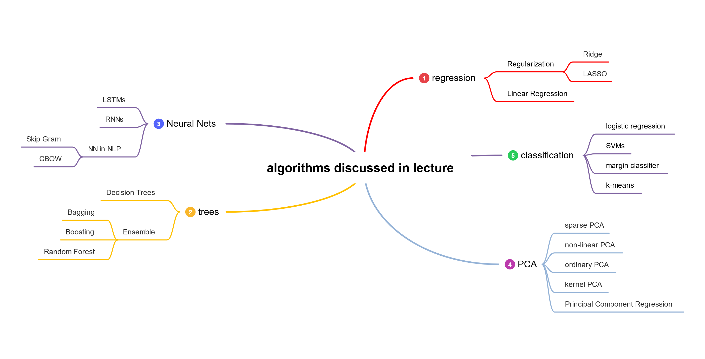
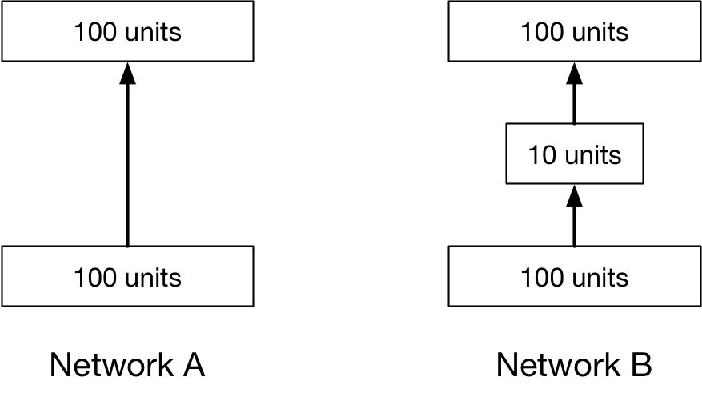

# Selbsttestfragen

Nachfolgende Fragen eigenen sich zur Prüfungsvorbereitung mittels **Active Recall** gedacht und eine Ergänzung zu [Karteikarten](https://github.com/KarelZe/edu/tree/55e29762b35fb16586fce118e8feaee3aa720fea/adv_ml/00_anki.md).

Zur Herkunft der Fragen:

* Fragen aus Altklausuren sind mit einem Stern \(⭐\) markiert. 
* Ein weiterer Teil der Fragen stammt aus der Vorlesung Maschinelles Lernen \(Grundverfahren\). Diese Fragen sind mit einem Gehirn \(🧠\) gekennzeichnet.
* Fragen der University of Toronto sind mit einem Camp \(🏕️\) markiert.
* Fragen der University of Berkley mit einem Feuerwehrmann \(🧑‍🚒\)
* Die übrigen Fragen sind eigene Fragen oder es handelt sich um Interviewfragen.

## Überblick

## Big Data

* F: _What are the characteristics of big data?_ ⭐
  * volume
  * variety
  * velocity
  * veracity
  * value
* F: _Explain three characteristics of big data?_ ⭐
  * Volume refers to the sheer amount of data that is generated.
  * Variety refers to diversity of types of data. Data can come in structured, semi-structured or even unstructured types.
  * Velocity refers to the sheer speed at which data is generated \(and processed\).
  * Veracity refers to the quality of data or accuracy of the collected data. To resolve data quality issues one has to apply sophisticated pre-processing.
* F: _What is the difference between veracity and variety?_

  Veracity refers to the quality of data \(e. g. noise in data\). While variety refers to types of data \(e. g. unstructured data\) in which data can come. As data is often collected from different sources both their types and their quality can differ.

## ML vs. Statistics vs. Econometrics

* F: _Compare ML to Statistics. What are the most significant differences?_

  Statistics is:

  * based on hypothesis, then collection of data and analysis
  * model-oriented with an emphasize on parametric models
  * focus on understanding on hypothesis testing

  Whereas in Machine Learning:

  * there is seldomly a priori hypothesis
  * data is collected in advance
  * analysis is data-driven not hypothesis-driven
  * analysis is algorithm-oriented rather than model-oriented
  * focus lies on prediction

* F: _Compare ML to Econometrics. In which way do both differ?_

  Econometrics is:

  * concerned about casual interference and counterfactuals
  * mostly centred around linear regressions and complex structural models
  * standard errors are often reported after one run

  Machine Learning is:

  * concerned about prediction
  * using all sorts of data-driven models e. g. Trees, NN etc.  

## Structure of data / CRISP-DM / Taxonomy

* F: _What are characteristics of unstructured data? Explain them._ ⭐

  Unstructured data is:

  * **Nonnumeric:** No predefined numeric representation for the constructs of interests. Must be defined.
  * **Multifaceted:** Each aspect of data provides unique information for studying and different types of research goals. E. g. voice data present information about the speaker such as pitch, speech rate. Data can be used both in psychology and communication.
  * **Concurrent representation:** Represents different phenomena at the same time. One can study different research questions with one single unstructured data.

* F: What is referred to as 'structured data'?
  * Structured data is data that adheres to a pre-defined data model and is therefore straightforward to analyse.
  * Structured data conforms to a tabular format with a relationship between the different rows and columns.
* F: _What is unsupervised learning?_ ⭐
  * Observe data and construct a low complexity description of the data. 
  * That means in unsupervised learning the dataset that a data set transforms into is _not previously known_ or understood. Data is not labelled. \(Grooking p. 13\) 
* Examples include clustering and PCA.
* F: _Give two examples for unsupervised learning techniques._ 
  * Clustering algorithms such as $$k$$-means
  * Dimensionality reduction techniques such as PCA
* F: _Give examples for structured / unstructured data._

  **Unstructured:** \(low degree of organization\)

  * Video Data, as video comes in different formats, compression ratios, sizes, where the video has to be transformed first to extract information from every single frame
  * Image Data, just like videos.

  **Structured:** \(high degree of organization\)

  * Numeric secondary data e. g. sales figures, as they come in a standardized format and easy to process format e. g. float with $$x$$ decimal places 
  * Categorial data e. g. gender, as there are predefined formats

* F: _Give a brief explanation of categorical, binary, ordinal and numeric variables._
  * **categorical / nominal:** Names of things or symbols.
  * **binary:** A nominal variable with two categories or states: 0 or 1.
  * **ordinal:** Ordinal variables have a meaningful order or ranking among them, but the magnitude between successive values is not known.
  * **numeric:** A quantitative variable. Numeric variables could be interval-scaled or ratio-scaled.
* F: _Which steps are part of the CRISP-DM model? Explain them in-depth._
  1. Business understanding i. e. developing an understanding of business objects and requirements of the data mining
  2. Data understanding i. e. identify and collect the data set needed to fulfil the business goals
  3. Data preparation i. e. prepare data for modelling
  4. Modelling i. e. build several models and assess them on a technical level.
  5. Evaluation i. e. Evaluate whether models are able to help achieve the business goals. Plan on the next steps.
  6. Deployment i. e. Deploy model to production. Make it accessible to customers.
* F: _Explain common techniques for data gathering._
  * **Bulk downloads:** Downloading large amounts of data. Often done using sophisticated software.
  * **APIs:** Accessing data through machine readable interfaces. Examples include Google Maps API.
  * **Web Scraping:** Extraction of data from websites. Often done using bots and web crawlers or manually.
* F: _Why is it desirable to work on normalized data?_
  * Some algorithms require normalized data, such as $$k$$-means clustering, which is 'isotropic' in all directions of space and therefore tens to produce more or less round  shapes. Not standardizing data would give more relative on variables with a smaller variance. \([See here.](https://stats.stackexchange.com/a/21226)\) 
* F: _Explain common techniques to analyse the relationship between variables._ 
  * A scatter plot \(or scatter diagram\) is used to show the relationship between variables
  * Bar plot for high dimensional data
  * Mean graph for categorial data
  * Correlation analysis
* F: _How can missing data be replaced? Explain._
  * **mean based imputation:** i. e. mean is calculated from all observations
  * **median based imputation:** Same as above but with median.
  * **stratified imputation:** i. e. structure of data is considered for replacements. E. g. missing height is different for gender male and female.
  * **regressed imputation:** i. e. replacing missing values by predictions of a regression model
* F: _Explain 3 patterns in which missing data can occur._
  * **Completely random / MCAR:** Missing values have no pattern. Can not be predicted.
  * **Missing at random / MaR:** Missing values can be predicted using other data available for observation. Assign a categorial value.
  * **Latent, yet unknown variable:** Missing value depends on latent and highly correlated variable.
* F: _What is a training, test and validation set for?_
  * **Training set** is used to fit all potential models
  * **Validation set** is used to select a model
  * **Test set** is used to estimate the predictive power on unseen data
* F: _What is the risk with tuning hyperparameters using a test dataset?_ 🧑‍🚒
  * Tuning model hyperparameters to a test set means that the hyperparameters may overfit to that test set. If the same test set is used to estimate performance, it will produce an overestimate. Using a separate validation set for tuning and test set for measuring performance provides unbiased, realistic measurement of performance. \(Berkley p. 14\)

## Multiple Linear Regression

* F: _Explain how linear regression works._
* F: _What is the purpose_ $$\beta$$ _in a Multiple Linear Regression Model?_
  * $$\beta$$ is a $$(p+1)$$-dimensional vector, where $$\beta_0$$ is the intercept and $$\beta_1,\cdots,\beta_k$$ are the regression coefficients of $$k$$ independent variables.
* F: _Explain how an optimal estimate for_ $$\beta$$ _can be derived._

  * A linear regression model has the best fit when the error term $$\epsilon$$ is minimal. To achieve this, the regression coefficients $$\beta$$ have to be estimated such that the error term is minimized. It's common to use squared error terms for $$\| \varepsilon \|_{2}^{2}$$ minimization. 
  * This leads to the following equation:

    $$
    \min _{\boldsymbol{\beta}} \sum_{i=1}^{N}\left(y_{i}-\beta_{0}-\sum_{j=1}^{p} x_{i j} \beta_{j}\right)^{2}=\min _{\boldsymbol{\beta}}\|\mathbf{y}-\mathbf{X} \beta\|^{2}
    $$

  Which can be reformulated to:

  $$
  \beta=\left(X^{\intercal} X\right)^{-1} X^{\intercal} y
  $$

  $$
  \epsilon=y-X^{\intercal} \beta
  $$

* F: Why do we optimize for the SSE for?
  * It is fully differentiable 
  * Easy to optimize
  * It also makes sense as:

    $$
    f^{*}(x)=\operatorname{argmin}_{f(x)} \mathrm{SSE} \Rightarrow f^{*}(x)=\mathbb{E}[y \mid x]
    $$
* F: _Compare Multiple Linear Regression to LASSO. Why is it desirable to penalize a Linear Regression model?_ 
* F: _Compare Multiple Linear Regression to Ridge Regression. Why is it desirable to penalize a Linear Regression model?_ 
* F: \*Name two measure to test the goodness of fit of a Linear Regression model.
  * Total Sum of Squares \(SST\)
  * $$R^2$$ 
* F: _Explain scenarios, where Ridge Regression would be preferred over LASSO._ 
  * Ridge only performs parameter shrinkage and no variable selection.
  * Ridge regression is preferred if one wants to insert some prior knowledge into approach. With ridge one has the ability to say that all features have at least some weight, even if it is very little [\(See here.\)](https://qr.ae/pG4QYT)
* F: _Explain scenarios, where LASSO would be preferred over Ridge Regression._ 
  * As with ridge regression, the LASSO shrinks the coefficient estimates towards zero.
  * However, in the case of LASSO some coefficient estimates are forced to be exactly equal to zero \(zeroed out\) when the tuning parameter $$\lambda$$ is sufficiently large. 
  * Therefore, LASSO does variable selection automatically and shrinkage of parameters.
* F: _Write the definitions_ $$R^2$$_, Adj._ $$R^2$$_, MAE, RMSE._ 
* F: _Compare_ $$R^2$$_, Adj._ $$R^2$$ _to MAE, RMSE. Name advantages and drawbacks._  
* F: _Compare_ $$R^2$$_, Adj._ $$R^2$$ _to MAE, RMSE. Which of these is normed._ 
* F: _Explain the 3 steps in fitting a regression model._ 
* F: _What is the advantage of using_ $$R^2$$ _over SST?_ 
* F: _In which way does adjusted_ $$R^2$$ _improve the standard_ $$R^2$$_?_ 
* F: _Explain the purpose of conducting an ANOVA test?_ 
* F: _Is the F-static normalized?_ What values can the F static take?\* 
* F: _How can the significance of a model be tested?_ 
* F: _Why does the improvement when adding new explanatory variables follow a chi-squared distribution with one degree of freedom?_ 
* F: _What is problematic about Multicollinearity?_ 
* F: _How can Multicollinearity be resolved?_ 
* F: _How does correlations and multicollinearity relate?_ 
* F: _Give the definition of the Variance Inflation Factor._ 
* F: _Explain how the Variance Inflation Factor can be calculated._ 
* F: _Name common assumptions about error terms._ 1. Regression Errors are normally distributed 2. The variance of regression errors is constant 3. The error terms from different points in time are independent 4. The residuals are uncorrelated with the independent variable.

  Linear Regression doesn't need the normal assumption, the estimator can be calculated without any need of such assumption. However, it is convenient from a user point of view to use errors are normally distributed to calculate confidence intervals etc. [\(see here.\)](https://stats.stackexchange.com/a/148812)

* F: _Name implications when residuals of a general linear regression model are not normally distributed._
* F: _Why do errors of a linear regression model have to be normally distributed?_ 
* F: _Why does variance of regression errors in a linear regression model has to be constant?_ 
* F: _Explain the concept of heteroscedasticity for regression errors._ 
* F: _Define the coefficient of partial determination._ 
* F: _How do the coefficient of partial determination and F-test relate?_ 
* F: _Why is it not desirable to use Linear Regression for default prediction?_ 

## Logistic Regression

* F: _In which day does logistic regression and linear regression differ?_
* F: _Explain what logistic regression is._ 
* F: _How is the maximum likelihood estimated in a logistic regression setting?_ 
* F: _What are the advantages of logistic regression over SVMs?_
* F: _What is the effect on the coefficients of logistic regression if two predictors are highly correlated?_
* A: [See here.](https://github.com/iamtodor/data-science-interview-questions-and-answers)
* F: _Calculate the probabilities of ... using logistic regression model._
* F: _How can logistic regression enhanced to a multiple logistic regression case?_ 

## Classification Evaluation

* F: _What is an imbalanced dataset in classification?_ ⭐
* F: _How do you deal with imbalanced data in classification?_
* A: [See here.](https://github.com/iamtodor/data-science-interview-questions-and-answers)
* F: _Why is it a bad idea to evaluate your algorithm on the training set?_ 🧠
* F: _What is the advantage/disadvantage of_ $$k$$_-fold CV vs. Hold-out method?_
* F: _Give an example for True Positive Rates etc.?_ 
* F: _Explain what precision and recall are. How do they relate to the ROC-Curve?_
* A: [See here.](https://github.com/iamtodor/data-science-interview-questions-and-answers)
* F: _Is it better to have many false positives, or too many false negatives?_
* A: [See here.](https://github.com/iamtodor/data-science-interview-questions-and-answers)
* F: _Draw a ROC Curve for given metrics._
* F: _Interpret a ROC Curve._ 
* F: _How is the AUC be calculated?_ 
* F: _Accuracy should not be the only criteria when comparing classifiers. Name 4 others._ 
* F: _Is Kappa static sensitive to imbalanced data?_ 
* F: _How can Kappa static be interpreted?_ 
* F: _How is Kappa static defined?_ 
* F: _In which way does the F-measure improve over simpler measure like precision?_ 
* F: _How is the F measure defined?_ 
* F: _What values can a F measure take?_ 
* F: _Define precision / recall / sensitivity / False Positive Rate._ 
* F: _Give an intuition for precision / recall / sensitivity..._ 
* F: _Derive a confusion matrix from given TP, FP..._ 
* F: _When classifying why is it not just sufficient to look at the accuracy?_ 
* F: _Draw a confusion matrix. Include the metrics, that are inside the cells._ 
* F: _How can a standard 2x2 confusion matrix be enhanced for a multi-classification case?_ 
* F: _Are ROC curves / is AUC sensitive to imbalanced data?_ If yes, how can it be resolved?\* 
* F: \*What kinds of datasets are difficult for a linear classifier to correctly classify?

## Cross-Validation

* F: _What is the motivation to use resampling methods such as cross validation?_ 
* F: _What are drawbacks of resampling approaches?_ 
* F: _How should we tune parameters for machine learning models?_ ⭐
* F: _Explain purged_ $$k$$_-fold cross-validation._ ⭐
* F: _How should we divide data into training and testing for a time series dataset?_ ⭐
* F: _What are bias and variance, and what are their relation to modelling data?_
* A: [See here.](https://github.com/iamtodor/data-science-interview-questions-and-answers)
* F: _Name at least techniques for cross validation._
* F: _Explain_ $$k$$_-fold cross-validation._ 
* F: _Explain the validation set approach?_ 
* F: _Explain the Leave-One-Out Cross-Validation._ 
* F: _What is the motivation to perform purged_ $$k$$_-Fold Cross Validation._ 
* F: _Why is bootstrapping used? Why is bootstrapping desirable?_ 
* F: _Explain what bootstrap is._ 

## Shrinkage Methods

* F: _Explain how forward stepwise selection works in 3 steps._ 
* F: _Explain how backward stepwise selection works in 3 steps._ 
* F: _Compare the subset selection methods forward and backward stepwise selection._ 
* F: _When is it desirable to use backward stepwise selection and when is it desirable to use forward stepwise selection?_ 
* F: _What is an alternative to subset selection methods?_ 
* F: _What are the reasons why shrinkage methods such as LASSO are preferred over subset selection methods such as forward stepwise selection?_
* F: _Compare the stepwise inclusion regression method to stepwise exclusion regression method and standard stepwise regression method._ 
* F: _Explain how the stepwise inclusion regression method / ... /... works._ 
* F: _In which way do stepwise inclusion method and stepwise exclusion method differ?_
* F: _Explain what regularization is and why it is useful_
* A: [See here.](https://github.com/iamtodor/data-science-interview-questions-and-answers)
* F: _Explain the ridge regression._ ⭐
* F: _Explain LASSO._
* F: _Explain the difference between LASSO and ridge regression?_ ⭐
* A: [See here.](https://github.com/iamtodor/data-science-interview-questions-and-answers)
* F: _In practice, explain what is the main difference between ridge regression and LASSO._ ⭐
* A: [See here.](https://github.com/iamtodor/data-science-interview-questions-and-answers)
* F: _Explain what is the difference between LSSO and linear regression?_ ⭐
* F: _What are the main applications of LASSO?_⭐
* F: _Compare LASSO and the stability selection technique._⭐
* F: _How do we apply the kernel trick to ridge regression?_ 🧠
* F: _Why does it make sense to penalize the norm of the weight vector?_ 🧠
* F: _Which norms can we use and what are the different effects?_ 🧠
* F: _Give the formula for ridge regression and explain its components._
* F: _Give the formula for LASSO and explain its components._
* F: _Name one major advantage of LASSO over ridge regression._
* A: Lasso yields sparse models, that is, models that only involve a subset of other variables.
* F: _How should_ $$\lambda$$ _be selected for ridge regression / LASSO?_
* F: _Explain how selecting tuning parameters works for ridge regression._

## Dimensionality Reduction

* F: _What are the advantages of sparse PCA over PCA?_⭐
* F: _What does dimensionality reduction mean?_ 🧠
* F: _What is PCA?_ 🧠
* F: _What are three things, that PCA does?_ 🧠
* F: _What are the roles of the Eigenvectors and Eigenvalues in PCA?_ 🧠
* F: _Can you describe applications of PCA?_ 🧠
* F: _Give the definition for PCA_
* F: _Explain the ordinary PCA._
* F: _Explain the sparse PCA._
* F: _Explain the nonlinear PCA._
* F: _Explain the kernel PCA._
* F: _Explain the major difference of sparse PCA over ordinary PCA._
* F: _Explain the major difference of non-linear PCA over ordinary PCA._
* F: _Explain the major difference of kernel PCA over ordinary PCA._
* F: _Give applications for PCA._

## Decision Trees

* F: _Mention three characteristics of impurity measures?_ ⭐
* F: _What are advantages of decision trees over random forests?_ ⭐
* F: _How can continuous attributes be handled in Decision Trees?_ ⭐
* F: _Explain what a decision tree is._
* F: _What are useful splitting criterions?_ 🧠
* F: _How can we influence the model complexity of the tree?_ 🧠
* F: _Name 3 impurity measures._
* F: _Compare the Gini-Coefficient to Entropy and the resubstitution error._
* F: _Name 3 conditions an impurity measure has to fulfil._
* F: _When should the Gini-Coefficient be used? When is it desirable to use the Entropy?_
* F: _Explain how categorical features can be split?_
* F: _Explain how numerical features can be split?_
* F: _What is the motivation to prune a decision tree?_
* F: _Explain how growing a decision tree works?_
* F: _How can decision trees be applied to a regression case?_
* F: _Name several advantages / disadvantages of decision trees_

## Bagging, Boosting and RF

* F: _What are tuning parameters for Boosting?_ ⭐
* F: _How does Boosting work for regression?_ ⭐
* F: _Explain what Boosting is_
* F: _Explain what Bagging is._
* F: _What ensemble techniques can be applied?_
* F: _How does Boosting work for classification?_
* F: _How does Bagging differ from Boosting? Explain the differences?_
* F: _How does Bagging work for regression?_
* F: _How does Bagging work for classification?_
* F: _What is the main advantage and disadvantage of a random forest over a decision tree?_ ⭐
* F: \*Describe how Gradient Boosting works.
* A: [See here.](https://github.com/iamtodor/data-science-interview-questions-and-answers)
* F: _Compare Boosting trees to Random Forests. What are the differences?_
* F: _Explain how a Random Forest improves ordinary decision trees._
* F: _Explain what a Random Forest is?_
* F: _When can it be advantageous to use Random Forests over Decision Trees?_
* F: _What are tuning parameters for Decision Trees?_
* F: _What are tuning parameters for Random Forests?_
* A: No. Trees + No. of predictors used to build each tree.
* F: _What is an ensemble algorithm? Give on example from the class of an ensemble model that gave improved performance over a base model._
* F: _Compare supervised learning to unsupervised learning. How do they differ?_
* F: _What are advantages / disadvantages of unsupervised learning techniques?_
* F: _What is PCA commonly used for?_
* F: _How can the proportion of variance explained by_ $$m$$ _variables be calculated?_
* F: _Calculate the PCA for the first 2 components?_
* F: _Sketch the algorithm for calculating the first two PCA components._

## k-means Clustering

* F: _Explain the_ $$k$$_-means clustering algorithm_ ⭐
* F: _How is the clustering problem defined?_ 🧠
* F: _Why is clustering called unsupervised?_ 🧠
* F: _How do clustering methods work? What is the rule of the cluster-2-cluster distance and which distances can we use?_  🧠
* F: _How does the_ $$k$$_-mean algorithm work?_ 🧠
* F: _What are the 2 main steps of_ $$k$$_-means?_ 🧠
* F: _Why does_ $$k$$_-means converge? What is it minimizing._ 🧠
* F: _Does_ $$k$$_-means find a global minimum of the objective?_ 🧠
* F: _Name similarity measures. Name an advantage and disadvantage for each of them._
* F: _Compare similarity measures for low and high-dimensional spaces._
* F: _In unsupervised learning, if a ground truth about a dataset is unknown, how can we determine the most useful number of clusters to be?_
* A: [See here.](https://github.com/iamtodor/data-science-interview-questions-and-answers)
* F: _What is the main idea of clustering?_
* F: _When is a clustering optimal?_
* F: _What properties does a set has to fulfil when_ $$k$$_-means clustering should be applied._
* F: _How does minimizing the WCV relate to solving the clustering problem?_
* F: \*What are alternatives to $$k$$-means clustering?
* F: _How can_ $$k$$_-means clustering be phrased as an optimization problem?_
* F: _What are advantages / drawbacks of using the $$k$-means algorithm?_
* F: _Name distance measures, that can be used with in conjunction with_ $$k$$ _means. When should they be used._
* F: _Draw a dendrogram from a given clustering._
* F: _Explain how the algorithm for hierarchical clustering works._
* F: _Explain different linkage types, that can be used for clustering._
* F: _Draw different linkage types visually._
* F: _What is the impact of using different linkage types?_
* F: _Name practical issues that arise with hierarchical or_ $$k$$_-means clustering._
* F: _Give applications for clustering._

## SVMs

* F: _Explain what a SVM is._
* F: _Required scaling for SVMs?_ ⭐
* A: Features should be scaled to the interval $\[0,1\]$.
* F: _Name advantages of SVMs over logistic regression._ ⭐
* F: _Recommendations to improve results of a SVM._ ⭐
* F: _Why is it good to use a maximum margin objective for classification?_ 🧠
* F: _How can we define the margins as optimization problem?_ 🧠
* F: _What are slack variables and how can they be used to get a "soft" margin?_ 🧠
* F: _How is hinge loss defined?_ 🧠
* F: _What is the relation between the slack variables and the hinge loss?_ 🧠
* F: _What are the advantages and disadvantages in comparison to logistic regression?_ 🧠
* F: _What is the difference between gradients and subgradients?_ 🧠
* F: _What is the definition of a kernel and its relation to an underlying feature space?_ 🧠
* F: _Why are kernels more powerful than traditional feature-based methods?_ 🧠
* F: _What do we mean by the kernel trick?_ 🧠
* F: _What is the central idea of SVMs?_
* A: We try to find a plane that separates the classes in the feature space. If that's not possible, we get creative in two ways:
  * We soften what we mean by separates through the introduction of support vectors.
  * We enrich and enlarge the feature space so that separation is possible. This means the feature space get's transformed.
* F: _What does a Maximal Margin Classifier maximize for?_
* F: _How do a Maximal Margin Classifier, SVMs and Logistic Regression relate?_
* F: \*What is the purpose of the support vectors $$\epsilon$$? 
* F: _Explain what is referred to as_ feature expansion\*?
* F: _Name and define kernels that can be used with SVMs._
* F: _Compare SVMs to logistic regression_
* A:
  * When classes are not linearly separable, SVM does better than logistic regression. \([See here](https://stats.stackexchange.com/a/95348)\)
  * Otherwise, the performance of logistic regression \(with ridge penalty\) and SVM are very similar. 
  * To estimate probabilities, the choice should be logistic regression.
  * If interpretability and speed is a major concern, logistic regression should be used.
* F: _Explain how Least-Squares Support Vector Regression improves ordinary SVMs for bond recovery rate prediction._
* F: _Explain how semiparametric Least-squares Support Vector Regression improves ordinary SVMs for bond recovery rate prediction._
* F: _Name proper alternatives to standard SVMs for default prediction._

## Neural Net

* F: _Explain what a Neural Network is._
* F: _How does logistic regression relate to neural networks?_ 🧠
* F: _What kind of functions can single layer NN learn?_ 🧠
* F: _Why do we need non-linear activation functions?_ 🧠
* F: _What activation functions can we use and what are advantages / disadvantages of those?_ 🧠
* F: _What output layer and loss function use given the task \(regression / classification\)?_ 🧠
* F: _Why not use a sigmoid activation function?_ 🧠
* F: _Why neural networks can overfit and what are the options to prevent it?_ 🧠
* F: _Early stopping, cross-validation and network pruning are techniques to prevent overfitting of Neural Nets. Explain them._ 
* F: _What makes an Ordinary Least Square Regression different from a neural net?_
* F: _Explain what Principal Component Regression is._
* F: _Explain how Principal Component Regression works._
* F: _Explain the purpose of activation functions._
* F: _Define different activation functions and sketch them._
* F: _Sketch a neural network with 3 input units, 4 hidden units and 2 output units. Make sure to label its components._
* F: _How is a recurrent neural net different from an ordinary neural network?_
* F: _Explain how back-propagation works in neural network._
* F: \*What is necessary to apply Neural Nets to classification tasks?
* F: For a fully-connected deep network with one hidden layer, increasing the number of hidden units should have what effect on bias and variance? 🧑‍🚒
* F: _What is the problem of Neural nets with many parameters?_ 
* F: _What is the impact of a higher number of layers and hidden units in a neural net?_
* A:
  * the more layers and more hidden units in a model, the more capacity it has.
  * There might not be enough data. A high capacity model easily overfits training data and results in a bad performance during testing.
* F: _Explain what network pruning is._
* F: _Explain how early stopping works with Neural Nets._
* F: _Consider the following two multilayer perceptrons, where all of the layers use linear activation functions. Give an advantage of Network A over Network B._ 🏕️

  

## RNN

* F: _Explain Recurrent Neural Networks \(RNN\)_ ⭐
* F: _What types of RNN were discussed in class?_
* F: _Give applications of RNNs._
* F: _What are key components of RNNs?_

## LSTM

* F: _Explain LSTMs._ ⭐
* F: _LSTMs are suitable for which type of analysis?_ ⭐
* F: _How can we use LSTMs for time series dataset?_ ⭐
* F: _Explain how LSTMs update their memory._
* F: _Give applications of LSTMS._

## Methods in NLP

* F: _How does the concept of Word2Vec work?_
* F: _How can the notion of similarity be embedded in a vector-to-word conversion?_
* F: _Sketch and explain the process of applying Continous Bag of Words to text prediction._
* F: _Why is Softmax used in a CBOW model?_
* F: _How does the Skip-Gram Model work_?
* F: _Compare the Skip-Gram Model to CBOW. In which way are they different?_
* F: _Explain different types of NLP applications including examples._
* F: _Explain what is commonly referred to as 'Named Entity Recognition'_
* F: _Name different approaches for 'Named Entity Recognition'. How do they relate._
* F: _Explain what a Sentiment Analysis is._
* F: _Name different Deep Learning Models used in NLP._

## RNNs / GRUs / Bidirectional LSTMs

* F: _Explain RNNs._
* F: _Explain GRUs._
* F: _Explain Bidirectional LSTMs._
* F: _Explain Differences between RNNs and GRUs._
* F: _Explain 'Bidirectional Long Short Term Memory Network'._
* F: _What problem of RNN's do LSTMs solve?_
* F: _Explain what is called the 'vanishing gradient problem'._
* F: _Why is it desirable to use RNNs instead of standard networks for NLP?_
* F: \*Explain why sigmoid activation results tend to be almost $$0$$ or $$1$$?
* F: _Adding more hidden layers will solve the vanishing gradient problem for a 2 layer neural network._ 🧑‍🚒
* F: _xxx suffer\(s\) from the vanishing gradient problem. Circle all that apply and JUSTIFY YOUR ANSWER._ 🧑‍🚒
* F: _Adding L2-regularization will help with vanishing gradients_ 🧑‍🚒

## Misc

* F: _Techniques that can be used for default prediction._ ⭐

