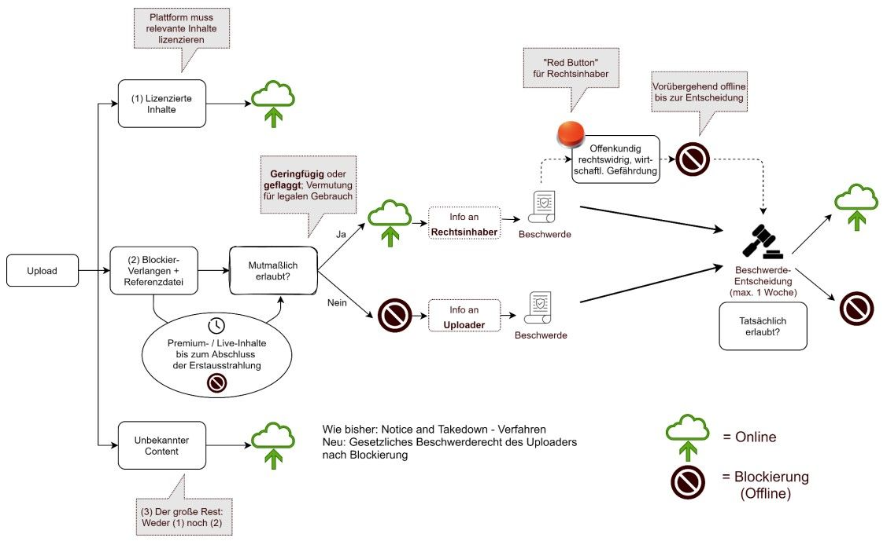

# ⚖ Aus der Werkstatt des Gesetzgebers. Vom politischen Auftrag zur Rechtsnorm

### Recht und Politik 👆

* Am Anfang steht der politische Auftrag, der sich aus Koalitionsvertrag ableitet, daraus soll Gesetz werden.
* Wer ist Gesetzgeber?
  * Gesetzgeber ist nicht näher bestimmt.
  * Sind es Politiker, Lobbyisten, Wissenschaft (z. B. Prof. Dreier mit Kommentaren zu Gesetzen), Gerichte, Legisten (Verfasser des Gesetzestexte)? Grundgesetz hat Antwort drauf.
  * Nach Grundgesetz wird:
    * Gesetzgebungsprozess kann durch Bundesregierung (ca. 90 % der Gesetzesentwürfe werden daraus initiiert), Mitte des Bundestages (d. h. Fraktionszwang wird aufgehoben, dann Gesetzprozess initiiert) oder Bundesrat angestoßen werden.
    * Bundesgesetze werden vom Bundestag beschlossen.
    * Ein vom Bundestag beschlossenes Gesetz braucht Zustimmung durch Bundesrat.
    * Bundespräsident segnet Gesetz nur noch ab.

**Kurzer Überblick:** [Video der Bundeszentrale für politische Bildung](https://film.bpb.de/system/files/videos/converted/588/588\_mp4\_high.mp4)

### Urheberrecht

* Teilgebiet des Immaterialgüterrecht
* Sachrechte sind rivalisierende Güter (_Jefferson's candle_). Immaterialgüter sind nicht rivalisierende Güter. d. h. bei Immaterialgütern verliert man nichts, wenn man das Immaterialgut teilt
* Immaterialgüterrecht schließt Patentrecht etc. ein
* Man hat 3 Ebenen beim Urheberrecht: International, europäisch, deutsches Urheberrecht.
  * Internationales Urheberrecht:
    * In 1995 wurde analoges Urheberrecht umgemünzt auf digitales Urheberrecht

#### Gründe für Urheberschutz

* Ökonomische Interessen (z. B. Kreative, die Film produzieren, wollen ihn auch absetzen können)
* Persönlichkeitsrechte (z. B. soll den Kreativen überlassen werden, wie mit Kreativem umgegangen werden soll, wann etwa und was veröffentlicht werden soll)
* Kriterien:
  * Nicht-rivalisierendes Gut
  * Anreizfunktion: Begrenztes Monopol
  * Fortschritt von Wissenschaft und Kultur
  * Balancierung von Verbots- und Zugangsrechten

#### Schutzgegenstände

* Text
* Fotos und Kunstwerke
* Liedkompositionen
* Bühnenstücke und Choreographien
* Filme und Software
* Designs und Architektur
* **Nicht:** Zufallsprodukte, Ideen, Fakten, tierisch entstandene Werke ([PETA Affe](https://www.sueddeutsche.de/panorama/rechtsstreit-um-affen-selfie-ich-wuenschte-ich-haette-die-verdammten-fotos-nie-gemacht-1.3610839)), mechanisch entstandene Werke.

#### Verwertungsrechte

* Verwertungsrechte sind Exklusivrechte.
* Man unterscheidet:
  * **Körperliche Verwertung:** Vervielfältigung (§ 16 UrhG) (erstes Verwertungsrecht), Verbreitung (§ 17 UrhG), Ausstellung (§ 18 UrhG)
  * **Unkörperliche Verwertung:** Vortrag-, Aufführung- und Vorführung (§ 19 UrhG), Öffentliche Zugänglichmachung (§ 19a UrhG), Sendung (§§ 20-20b UrhG)

Nutzung mit vertraglicher Erlaubnis:

* **entgeltlich** (z. B. klassischer Lizenzvertrag)
* **unentgeltlich** (z. B. CC Lizenz → Unentgeltliche Nutzung unter bestimmten Bedingung z. B. [CC BY-SA 3.0 DE](https://creativecommons.org/licenses/by-sa/3.0/de/))
* **Schranken:** Schranken erlauben Nutzung, ohne dass man Erlaubnis benötigt.
  * Zitatrecht: Gesetzliche Erlaubnisse z. B. Zitieren bei Benennen einer Quelle. Es wäre unpraktikabel jeden Autor zu kontaktieren.
  * Privatkopie.

#### Economics for the common good

* **Linker Teil der Glocke (1):** kreative Arbeit würde nicht mehr erfolgen, weil nicht mehr gegenfinanziert.
* **Rechter Teil der Glocke (2):** Produktion wird gehindert, kein Austausch mehr passiert → Vergleiche Wissensaustausch in Wissenschaft
* **Schrankenbestimmungen (3):** sind dazu da, die Balance zwischen beiden zu schaffen.

### Welt-Urheberrecht

* Drei-Ebenen-System: Es existiert deutsches, europäisches und internationales Urheberrecht.
* Für internationales Recht ist World intellectual property organization (WIPO) in Genf zuständig.
* Basis für internationales, digitales Urheberrecht ist Bericht: _Intellectual property and the national information infrastructure_. Weiterer Meilenstein war dann World Copyright Treaty (WCT). War aber weitestgehend eine Anwendung von analogem Recht. Zwischen analog und digital besteht aber großes Unterschied.

#### Urheberrechtliche Lizenzen im analogen und digitalen Ökosystem

* **Analog:** Es gilt First-sale Doktrin, danach endet Urheberrecht z. B. kann Buch verschenkt, vernichtet werden etc.
* **Digital:** Autor lizenziert an Verleger. Bei Kauf z. B. von E-Book schließt man nur Nutzungsvertrag ab. Vertrag reicht bis in eigene Sphäre. Im Web 2.0 ist man selbst auch Urheber, wenn man z. B. Bilder teilt.

### EU und die DSM Richtlinie👆

#### Verordnungen

* EU Verordnungen (_regulations_) gelten unmittelbar. Wird nur noch abgerundet durch nationale Verordnung. Begrenzt nationale Spielräume.

#### Kommission

* **Kommission** Nur Kommission ist befugt, Gesetzgebungsvorschlag einzubringen
* **Rat** (d. h. Vertretung der Mitgliedsstaaten) Kann nicht einbringen → Im Rat sind Ratsarbeitsgruppen / Gremien z. B. Experten, AStV (Botschafter), Rat (Fachminister), Europäischer Rat (Staatschefs) tätig.
* **Europäisches Parlament** → Kann nicht einbringen
* Europäische Gesetzgebung ist schwieriger wegen unterschiedlicher Rechtsverständnisse, kultureller Hintergründe

#### Gesetzgebung in Brüssel

* EU Kommission macht Gesetzesvorschlag. Dieser wird dann im Rat beraten und wird dort in Gremien eingebracht. Parallel wird Text beim Europäischen Parlament eingereicht.
* Bei Uneinigkeit zwischen Rat und Europa-Parlament ist Vermittlungsausschuss (s. g. Trilog) vorgesehen. Änderungen sind aber komplex, weswegen Trilog häufig durch informellen Trilog ersetzt wird.
* Informeller Trilog ist Alternative zu einem ordentlichen Gesetzgebungsverfahren oder ein Art Hinterzimmer Verfahren.
* Als Arbeitsgrundlage dient Vier-Spalter (_4-Column document_). Enthält Text der Kommission, des Parlaments und des Rats. Vierte Spalte ist in Ampel-Farben z. B. rot ist streitiger Punkt
* Non-paper (d. h. Vorschläge, woraus nicht ersichtlich ist, wer den Änderungsvorschlag macht) kommen häufig von Regierungen oder Lobbyisten.
* Verfahren ist intransparent, weil häufig nicht mehr klar ist, wie Entscheidung zustande kam.
* Problematisch ist, wenn insbesondere gegen Ende nochmal massiv in Texte eingegriffen wird.
* Problematisch ist auch, dass alle Sprachfassungen gleichwertig sind. Bei Übersetzung können selbst Unschärfen entstehen z. B. Komma, das auf Aufzählung folgt.

#### Digital Single Market

* Aus Digital Single Market (DSM) ging "Artikel 17" hervor.
* Deutsche Regierung hat "Artikel 17" zugestimmt, aber Zweifel im Protokoll geäußert. Protokoll selbst ist aber unerheblich.
* Akteure im digitalen Urheberrecht
  * Aus dem klassischen Urheberrecht
    * Kreativen
    * Verwerter
  * Neue Player im Web 2.0:
    * Plattformen / ISPs
    * Prosumenten / Prosumer (Konsumenten, die selbst Inhalte produzieren) (Social Web)

### Deutsche Umsetzung von Artikel 17 / (13) 👆

* Neue Nummer "17" im Gesetz, weil neue Inhalte
* **Value Gap:** Verbreiten Inhalte die Nutzer hochladen, verdienen damit Geld, sind aber nicht bereit Inhalte zu lizenzieren.

### Rechtsumsetzung

* Best Practices für Gesetzestexte:
  * 1 Paragraph soll nicht mehr als 3 Absätze haben
  * 1 Absatz nicht mehr als 1 Satz
  * 1 Satz nur einen Rechtsgedanke
* Europäische Gesetze weißen oft Widersprüche, Lücken, Inkonsistenzen etc. auf.
* Bei Artikel 17 musste "Quadratur des Kreises" geschafft werden d. h. Urheberschutz sichergestellt (d. h. nicht lizenzierte Inhalte sollen nicht online gehen), Nutzerrechte gesichert werden. Braucht automatisierte Systeme, die aber nicht zwischen erlaubter Nutzung z. B. Parodie und Gesetzesverletzungen unterscheiden können.
*   Grundlegender Prozess für Formulierung eines Gesetzestexts ist Denken (analysieren), visualisieren (strukturieren) dann schreiben.

    * **Denken:** Nach Eisberg-Modell auch auf Wirkfaktoren acht geben, einfache Antworten meist falsch, komplizierte brauchen meist länger,
    * Pro und Contra von Auslegung (sg. _transposing_)
      * Pro:
        * Anpassung an nationale Erfordernisse
        * Kleinere Beteiligte führen zu weniger Unsicherheiten z. B. kleine Plattformen
        * Weniger strategische Gesetzgebung d. h. as nicht durch Gesetzgeber geregelt, wird durch Gerichte geregelt. Man will entgegenwirken, dass einzelne Akteure klagen, um Gesetze noch zu ihren Gunsten zu verschieben. ("Schwierige Fälle machen schlechte Gesetze")
      * Contra:
        * Weitere Fragmentierung von digitalem Binnenmarkt
        * Endgültige Gewissheit / letztes Wort nur durch Entscheidung des Europäischen Gerichtshofs (ECJ)
        * Gefahr der Auslegung entgegen des EU Gesetzes (Gefahr der Staatshaftung)
    * Abwägung zwischen Blockierungsanfrage und User-Rechten. Hierfür sind automatische Systeme (sg. Uploadfilter notwendig). Diese können aber nicht verlässlich Schrankennutzung z. B. Zitate, Parodie erkennen. Wichtige Frage ist also, was muss ex-ante blockiert werden d. h. darf niemals online gehen und was darf später noch entfernt werden? -**Visualisierung:** Erstmal visualisieren z. B. im Film mit Story board, in der Informatik mit Pseudocode. Passiert ähnlich auch bei der Entwicklung der Struktur des Gesetzes (z. B. [Visualisierung](vortrag\_1.md)) -**Schreiben:** Texten nach dem Hamburger Modell d. h. Einfachheit, Gliederung / Ordnung, Kürzung / Prägnanz, Anregende Zusätze.
    * Vor dem Schreiben der Textblöcke, werden erstmal die Textbausteine in Verbindung zueinander gesetzt. Kumulative Logik kann durch Verzweigungen abgebildet werden. Boolesche Algebra aber allein vermutlich nicht ausreichend.
    * Mit Diskussionsentwurf können relativ unvoreingenommen präsentiert werden.Grundlage für Regierungsentwurf.

    ### Konzept der Upload-Filter

    * Upload-Filter gab es bei YouTube schon lange und auch schon zuvor in Deutschland
    * Upload Filter steht im Spannungsverhältnis, dass bestimmte Nutzungen z. B. Zitate erlaubt sind.
* Man hat 3 Arten von Uploads
  1. Lizenzierte Inhalte z. B. Video mit lizenzierter Musik. Plattform zahlt Lizenzgebühr. Sie profitiert selbst von Konsum durch Werbeeinnahmen. Unproblematisch, weil bereits lizenziert.
  2. Unbekannter Content z. B. Drittinhalte, die u. U. nicht lizenziert sind. Kennt Plattform nicht. Inhalt muss identifizierbar sein. Rechteinhaber müsste Referenzdateien für eindeutigen Abgleich der Hashwerte bereitstellen. Aus diesem Grund wurde mutmaßlich erlaubte Nutzung erfunden.
  3. Unbekannte Inhalte.
* Konsequenzen bei Verstößen:
  * Für Uploader ist Lage schwierig, wenn man geblockt wird z. B. müsste man Schaden nachweisen.
  * Es gibt Verbandsklagerecht d. h. Verbände können Plattform auf Unterlassung verklagen. Kostet Reputation und Geld (vgl. Verbandsklagerecht von Verbraucherverbänden gegen Banken).
  * Es gibt mutmaßlich erlaubte Nutzung. Folgendes soll nicht blockiert werden z. B. Ausschnitte, Parodie, Snippets (d. h. 15 Sec. Video). Erstmal keine Haftung / entspanntere Haftung.
  * Algorithmen-basierte Umsetzung war oberste Leitlinie.
  * Es gibt "Roten Knopf" für Rechte Inhaber. Soll vor Missbrauch (z. B. Beispiel von Hollywood Film, der in 3 Teile geschnipselt wird) schützen, indem Inhalt vorübergehend offline genommen wird.
  * Mutmaßlich erlaubte Nutzung ist zentrales Element.
  * Es gibt Recht zur Handlung, um Nutzerinteressen zu wahren.

#### Referenzen

Bundesministeriums der Justiz. 2021. ‘FAQ Zum Gesetz Zur Anpassung Des Urheberrechts A n Die Erfordernisse Des Digitalen Binnenmarkts’.

Europäische Bewegung Deutschland. o. J. „Trilog sorgt für fehlende Transparenz – nicht nur bei der Reform des Urheberrechts“. Abgerufen 21. Januar 2022 ([https://www.netzwerk-ebd.de/nachrichten/trilog-sorgt-fuer-fehlende-transparenz-nicht-nur-bei-der-reform-des-urheberrechts/](https://www.netzwerk-ebd.de/nachrichten/trilog-sorgt-fuer-fehlende-transparenz-nicht-nur-bei-der-reform-des-urheberrechts/)).

Schmid, Matthias. 2022. ‘Aus der Werkstatt des Gesetzgebers – Vom politischen Auftrag zur Rechtsnorm’.

Tirole, Jean, und Steven Rendall. 2017. _Economics for the Common Good_. Princeton, New Jersey: Princeton University Press.
