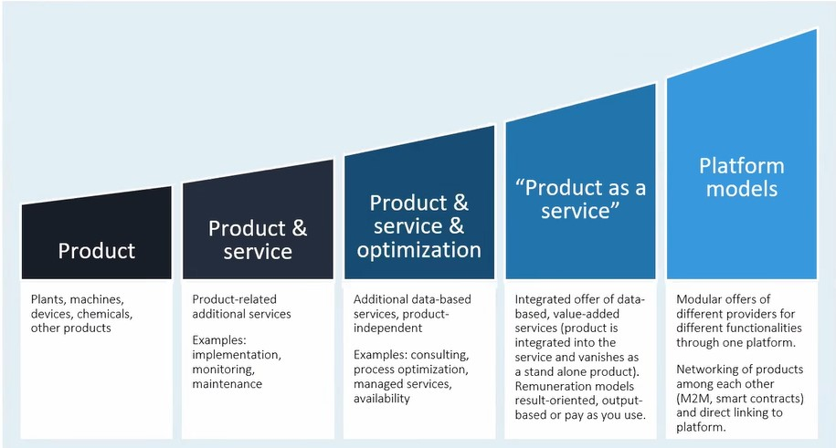

## Auswahl über aktuelle Gesetzesentwurf

- Data Governance Act: Ziel ist Aufbau einer datengetriebenen Wirtschaft, im Einklang mit europäischen Werten.
- Digitale-Inhalte-Richtlinie: Erlaubt auch personenbezogene Daten als Gegenleistungen zu verwenden.
- Artificial Intelligence Act: Regulierungsrahmen für künstliche Intelligenz.

## Personenbezogene Daten
- **Personenbezogene Daten** sind alle Informationen, die sich auf eine **identifizierte** oder **identifizierbare** natürliche Person beziehen. Identifizierbar ist eine natürliche Person, die direkt oder indirekt mittels Zuordnung wie z. B. Namen identifiziert werden kann.
- **Beispiele für Personenbezogene Daten:**
    1. **Fahrverhalten bei KFZ:** Blackbox für Messung des Fahrverhaltens zur Bepreisung der KFZ-Versicherung. Problem dass Versicherung die Fahrdaten erhält, wurde Auswertung an Provider ausgelagert und nur Score ermittelt. Trotz aggregiertem Score handelt es sich immer noch um personenbezogene Daten.
    2. **AIS Daten für Binnenschiffe:** sind ebenfalls personenbezogene Daten. Etwa ist leicht herauszufinden, wer das Schiff führt. Mit AIS Daten, weiß man dann wo sich die Person befindet. Damit besteht Personenbezug.
    3. **Sensoren an Baumaschinen:** Dichtigkeitsmessungen des Bodens für Baumaschinen sind *industrial data*, trotzdem kann man aus Benutzung der Maschine auch den Bezug zu Maschinenführer herstellen.

## Neue Geschäftsmodelle

1. **Big Data:** Technologische Möglichkeiten z. B. auf Gebiet der Datensammlung und Auswertung um zukünftige Nutzung zu unterstützen.
2. **Services:** Produkte als Dienst z. B. *Software as a service*
3. **Rollen und Kooperationen:** Netzwerke als Wertschöpfungskette und Prozesse innerhalb und zwischen Unternehmen z. B. Industrie 4.0, individualisierte Produkte
4. **Plattformen:** Neue Geschäftsmodelle basierend auf Plattformökonomie z. B. Amazon, Alibaba oder *Sharing Economy* z. B. Uber, Lift

- **Beispiel Türsystem als IoT-Device:** 
    - Türsystem das Zustands- und Betriebsdaten zu seinen Produkten erhebt über ein IOT-Gerät.
    - Rechtliche Fragestellungen:
    1. Wie lässt sich predictive Maintenance vertraglich abbilden?
    2. Wie wird möglicher Personenbezug gehändelt?
    3. Wie wird Haftung bei Brand geregelt?
    4. Wem gehören die Daten des IoT-Devices? z. B. Türbetreiber o. Ä.
    5. Zustimmung / Rechteinräumung durch Türbetreiber notwendig?
    
## Maschinendaten und Datenschutz
- Für Maschinendaten reicht Personenbeziehbarkeit aus z. B. Bezug auf Maschinenführer.
- Personenbezug kann auch **nachträglich** durch **Verknüpfung von Daten aus anderen Quellen** hergestellt werden.
- **Folgen von der Anwendung des Datenschutzrechts auf Maschinendaten:**
1. Verbot mit Erlaubnisvorbehalt d. h. man braucht Legitimationsgruppe für Datenverarbeitung
2. Gebot der Zweckbindung
3. Privacy by design and by default
- **Strenge Auslegung nach Härting:** Unterscheidung zwischen Maschinendaten und Personendaten praktisch nicht mehr gegeben.
- **Fazit:** 
    - Klare Trennung von personenbezogenen und reinen Maschinendaten wird nur im konkreten Anwendungsfall möglich sein z. B. je nach Anwendungsfall rein technisch oder auch personenbezogen.
    - Regime für wirtschaftliche Verwertung von Daten muss für nicht-personenbezogene Daten als auch personenbezogenen Daten passen.

### Data Ownership und Maschinendaten
- Daten sind **keine Sachen** wegen fehlender Körperlichkeit deshalb kann kein **Eigentum** oder **Besitz** daran bestehen.
- Daten gehören damit niemanden, sondern faktisch demjenigen, der sie besitzt d. h. darauf zugreifen kann.
- Sachenrechtlicher Schutz besteht nur am Datenträger.
- Sind Daten Teil der Datenbank, dann besteht Schutz des Datenbankherstellers, weil wesentliche Investition zum Aufbau der Datenbank notwendig war.
- Bislang ist **kein** Daten-Eigentum i. S. eines Sachbesitz-ähnlichen Schutzes im Gesetz verankert. Schwierig national umzusetzen wegen einer Vielzahl an bestehenden EU-Regelungen. Außerdem ist nicht immer ganz einfach zu beantworten, wer Datenerzeuger ist z. B. Fahrer etc.
- Wegen fehlender Gesetzlicher Regelung:
    1. ist Kenntnis über Vorhandensein der Daten notwendig (Data Governance)
    2. braucht es ein durchdachtes, dokumentiertes Konzept zum Umgang mit Daten
    3. braucht es Verträge zur Absicherung z. B. für Datengetriebene Geschäftsmodelle

Schichtenmodell:
1. Datenträger
2. Daten "als solches" / Rohdaten (syntaktische Ebene)
3. Datenbank (systematische Ebene)
4. Inhalt der Daten / Geschäftsgeheimnis (semantische Ebene)

Rechtliche Allokation:
1. Eigentum (zivilrechtlich)
2. Exklusive Nutzungsrechte
3. (Nicht-exklusive) Nutzungsrechte
4. Public domain

Rechtliche Ansprüche:
1. Zugriff
2. Nutzbarkeit
3. Portierbarkeit
4. Schutz
5. Verhinderung
6. Unterlassungsanspruch

### Was sind Maschinendaten?
- Daten, die von Maschinen produziert werden.
- Umfasst:
    1. Geschäftsgeheimnisse
    2. Persönliche Daten
    3. Bestandteil geschützter Datenbank (*Part of IP*)
    4. *Ownership*

### Beispiele und neue Geschäftsmodelle

Aus Maschinendaten kann man ggf. auch personenbezogene Daten ableiten z. B. ob und durch wen die Maschine regelmäßig gewartet wurde. Für Anwendung des Datenschutzrechts reicht Personenbeziehbarkeit von Daten bereits aus, z. B. Bezug auf den Maschinenbediener. Gedanklicher Ausgangspunkt könnte daher sein, dass man annimmt, dass Unterscheidung zwischen Maschinendaten und Personendaten hinfällig ist.

## Integration von Data Governance in Geschäftsprozesse

### Data Governance
- Data Governance ist Gesamtwissen über alle Arten von Daten hinweg. Umfasst Unternehmensdaten z. B. IP als auch personenbezogene Daten. Schließt die Qualität, Integrität, Verfügbarkeit, Sicherheit und Integration ein.

### Link zwischen Data Governance und Geschäftsprozessen

- Prozesslandschaft meint **Unternehmensprozesse**. Man unterscheidet Managementprozesse (Unternehmen steuern) Kernprozesse, Unterstützungsprozesse (unterstützen Kernprozesse).
- Interessierte Parteien (sg. Stakeholder) z. B. Gesetzgeber
- Messbare Ergebnisse = Es geht um Zufriedenheit z. B. des Gesetzgebers = Gesetzeskonformität oder Kunden = Liefertreue
- Sichtweise auf Daten in Prozessen wird häufig vernachlässigt.
- Verweben von Daten mit Prozessen durch sg. **Prozess Turtle**. Bei **Prozess Turtle** ist Prozess in Phasen geteilt, Phasen sind durch Gate abgetrennt. Zwischen einzelnen Phasen besteht ein Fluss. Prozess ist erweitert um technische Ressourcen: z. B. EDV-Ausstattung, Prozess-Eingaben, Prozess-Ergebnissen. Prozess-Turtle muss so erweitert werden, dass Verarbeitung von Daten berücksichtigt wird z. B. Löschung von Personenbezogenen Daten, Berechtigungskonzept.
- **Beispiel für Turtle Produktentwicklung**: In autonomer Fabrik würde Track-and-Trace Sensor getrackt werden, ob z. B. Gabelstapelfahrer ein Päuschen macht. Prozess-Turtle muss so erweitert werden, dass Verarbeitung von Personenbezogenen Daten berücksichtigt wird.
- Über Prozesssicht kann gut gesteuert werden, was mit Personen-bezogenen Daten passiert bzw. was noch fehlt.

-**Fazit zum Designprozess:** Es ist unglaublich teuer, Software nachträglich anzupassen. “Privacy as a product feature” wäre die Lösung d. h. Privacy sollte bereits bei der Konzeption der Software berücksichtigen.

## Herausforderungen für das Vertragsrecht

- Oft ist Zuordnung zu althergebrachten Vertragsrechten des BGB schwierig.
- *Rolls Royce* ist Vorreiter bei Vertrieb von Betriebszeiten bei Flugzeugturbinen anstatt dem Verkauf der eigentlichen Turbinen
- Neuigkeit ist, dass Produkte angeboten werden können, die mit eigentlichem Produkt gar nichts mehr zu tun haben, sondern daraus entstehen, weil man Daten zur Verfügung hat.
- International ist es recht einfach datenbasiertes Geschäftsmodell umzusetzen. In Deutschland muss noch AGB-Recht berücksichtigt werden.
- Vertragsrecht ist flexibel. Vertragsrecht ist ohne absolute Wirkung, weil kein Dateneigentum bestehen kann. 
- Grundlage für Verträge z. B. Cloud-Vertrag sind immer die jeweiligen gesetzlichen Grundlagen des Vertragstyps z. B. Mietvertrag.
- Es gibt noch keine Standards für rechtliche oder vertragliche Absicherung der Datennutzung.
- Wenig Leitplanken für Datenlizenzverträge z. B. kein gesetzliches Leitbild für AGB-rechtliche Prüfung. Es besteht weniger Orientierung als bei anderen Vertragsgegenständen z. B. für Software.

## Datenlizenzvertrag
- Orientiert sich an Know-How-Lizenzverträgen.
- Wichtige Regelungsgegenstände:
    - Definition, Kategorisierung und Zuweisung der Inhaberschaft an betroffenen Daten
    - Recht auf Übermittlung oder Zugang zu den Daten (faktischer Zugriff / Schutz vor Abschottung)
    - Einräumung von Nutzungsrechten:
        - exklusiv / nicht-exklusiv; übertragbar und/oder unterlizenzierbar; zeitliche, räumliche inhaltliche Beschränkung
        - Genaue Festlegung / Aufteilung von Verwertungshandlungen und der Verwertungszwecke
    - Datenschutz, Geheimhaltung, IT-Sicherheit und Löschung
        - Personenbezogene Daten
        - Reverse Engineering
    - Beschaffenheitsvereinbarung (Data Quality Agreement), Abgrenzung von Risiko- und Verantwortungsbereichen
    - Sonstiges: Laufzeit, Haftung, etc.
    - **Beispiel:** BMW ConnectedDrive. Ggf. ist Zustimmung gar nicht notwendig, wenn z. B. personenbezogene Daten notwendig sind, um z. B. Notruf abzusetzen.

## Haftung und Risikomanagement

- **Beispiel** Lieferung von Vorratsschutzmitteln (Mittel zum Schutz von Lebensmitteln vor Schädlingen). Auf Schiff ist Sensor verbaut, um in Silo den Gasgehalt zu messen. Hier entsteht Haftungsproblematik. Fällt Software aus, kann man nicht mehr beurteilen, ob Lebensmittel ausreichend begast sind. Ggf. läuft Schiff dann zu spät in Hafen ein. Industrieunternehmen wäre dann mit Haftungsproblematik konfrontiert.
- Man unterscheidet **vertragliche** und **außervertragliche Haftung**. Vertragliche Haftung ist **verschuldensabhängig** d. h. Verschulden muss erst nachgewiesen werden. Außervertragliche Haftung nach Produkthaftungsgesetz ist **verschuldensunabhängig**.
- Zu Verkehrssicherungspflichten / Sorgfaltspflichten gehören:
    1. Konstruktionsfehler
    2. Fabrikationsfehler
    3. Instruktionsfehler z. B. auf Fehlerquellen hinweisen
    4. Pflicht zur Produktbeobachtung z. B. wenn gegen obige Pflichten verstoßen wird.
- Neue Haftungsfragen:
    1. Wem werden Fehlentscheidungen zugerechnet z. B. Hersteller, Zulieferer, Systembetreiber?
    2. Höhere Anforderungen an die Sorgfaltspflichten des Herstellers
    3. Verschuldens-Haftung des Betreibers
    4. Haftungsklauseln z. B. um Haftung zu begrenzen
- **Fazit:** Verantwortung sollte klar in abgestufter Leistungsbeschränkung abgegrenzt werden.
- **Fortführung Beispiel:** Bei Beispiel mit Gas-Sensor handelt es sich nur um Vorschlag / Empfehlung. Anwender hat Pflicht zur Prüfung dieser Empfehlung.

## Referenzen

Meyer van Raay, Oliver. 2022. „Daten: Rohstoff digitaler Geschäftsmodelle und Herausforderung für das Recht“.
