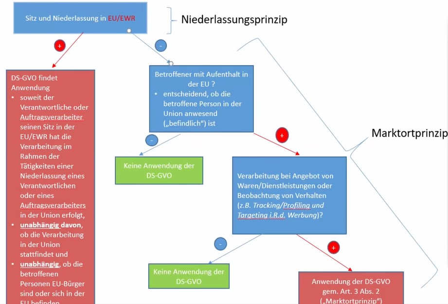

# ⚖ Datenschutz im Internet und Cybersecurity


Hilft dir meine Webseite weiter? Falls du dieses Projekt unterstützen möchtest, kannst du mir gerne einen Kaffee an [paypal.me/markusbilz](https://paypal.me/markusbilz?country.x=DE\&locale.x=de\_DE) spenden. Danke.️:heart:


## Räumlicher Anwendungsbereich der DSGVO 🌍

* **Hintergrund:** Es ging um spanischen Rechtsanwalt Gonzalez vs. Google. Google hat bestritten, dass Suchmaschine durch EU Tochter betrieben wird. Ist aber eigentlich auch egal, weil EU Niederlassung bestand, die noch nicht mal was mit der Suche zu tun hat. Dann findet die DSGVO Anwendung. Darüber hinaus gilt das Marktortprinzip, da sich der Betroffene in der EU befand (siehe Schema oberhalb).

## Datenübermittlung in andere Länder 📨

* Drittstaaten mit Angemessenheitsbeschluss (\~Drittstaaten, denen ein angemessenes Datenschutzniveau bescheinigt ist): Schweiz, Kanada 🍁, Guernsey, Isle of Man, Jersey, Färöer, Andorra, Israel, Uruguay, Japan 🗾, Südkorea und UK.
* Anderen Drittstaaten insbesondere den USA (vgl. relevante Dienste wie Google Analytics) wurde kein angemessenes Datenschutzniveau bestätigt.
* Es gibt einen zweistufigen Ansatz:
  1. **Stufe 1:** Erlaubnis für die Verarbeitung (inkl. Weitergabe / Offenlegung) personenbezogener Daten im Inland oder der EU / EWR. Werden einem Datenimporteur (ausländischer Verarbeiter) Daten zugänglich gemacht durch den Datenexporteur, dann müssen sämtliche Regelungen beachtet werden, die Datenverarbeitung in der EU gelten.
  2. **Stufe 2 nach Art. 44 ff. DSGVO**:
     * Prüfung ob Angemessenheitsbeschluss nach Art. 45 DSGVO der EU für Drittland z. B. Färöer vorliegt.
     * Vorliegen geeigneter Garantien im Sinne des Art. 46 DSGVO:
       * Standarddatenschutzklauseln
       * verbindliche interne Datenschutzvorschriften (BCR / PBCR) der Konzerne, die von den zuständigen Datenschutzbehörden genehmigt wurden
       * Individuell von Datenschutzbehörde genehmigte Datenschutzklauseln
     * Inanspruchnahme der Ausnahme nach Art. 49 DSGVO, wenn Übermittlung **nicht wiederholt** erfolgt, in begrenzter Zahl von betroffenen Personen und für die Wahrung der zwingenden berechtigten Interessen des Verantwortlichen erforderlich ist.
       * Erfordert die Einwilligung der betroffenen Person nach Aufklärung über die Risiken der Übermittlung in ein Drittland.
       * **Beispiel**: Tourist, der Hotel in den USA bucht.

## Schrems II ⚖️

* Mit Schrems I wurde bereits das Save Harbour Abkommen gekippt, weil US Nachrichtendienste trotzdem ausspioniert haben.
* Analoge Argumentation in Schrems II. EU Standardvertragsklauseln (sg. SCC = Standard Contractual Clauses) der DSGVO sind ebenfalls nicht ausreichend, weil bei Datenimport nach EU auch die Nachrichtendienste zugreifen können.
* In Konsequenz muss Datenexporteur zukünftig ermitteln, ob für den Transfer von betroffenen Daten ein angemessenes Datenschutzniveau im Empfängerland besteht:
  * Risiken beim Übertragungsweg z. B. Staatliche Überwachung von Seekabeln
  * Branchenspezifische Gesetzgebung z. B. FISA, Cloud Act für bestimmte Empfänger / Datenimporteur (z. B. Telekommunikationsanbieter), die einem Zwang zur Kooperation mit Geheimdiensten unterliegen
  * Zumutbare Alternativen, die keinen Datentransfer erfordern. Führt zur Wirtschaftsförderung kleinerer, europäischer Anbieter.
* Falls Datenschutzniveau nicht ausreichend, braucht es zusätzliche (technische) Maßnahmen z. B. Verschlüsselung und vertragliche Ergänzungsgarantien (sg. _Warrant canary_). Verschlüsselungsdienst sollte selbst nicht in Drittstaat sein!
* Max Schrems (mit Vehikel NOYB) strengt eine Vielzahl von Verfahren an und prozessiert solange bis die Verfahren zu Ende getrieben sind. Diese Taktik wird 101 Dalmatiner genannt.
* Bei Datenübertragung z. B. Google Analytics reicht nicht aus, dass IP anonymisiert wird, weil u. A. bei angemeldeten Nutzern für Google leicht ein digitaler Fußabdruck erstellt werden kann z. B. zu Alter, Region o. Ä.

## Bezahlen mit Daten 💶

* Regelungen kamen mit Umsetzung der EU-Richtlinie für digitale Inhalte und Dienstleistungen (DI-RL 2019/220/EU) hinzu.
* Daten sind kein Zahlungsmittel im bankenrechtlichen Sinne.
* Aber Gesetzgeber hat neuen Mangelbegriff, Regelungen zu End-of-Life zugunsten des Verbrauchers eingeführt.
* **Anwendungsbereich nach § 327:** Die Vorschrift gilt für Verbraucherverträge über die Bereitstellung digitaler Produkte, bei denen der Verbraucher dem Unternehmer personenbezogene Daten bereitstellt oder sich zu deren Bereitstellung verpflichtet, es sei denn die Voraussetzungen des [§ 312 Abs. 1 a Satz 2](https://www.gesetze-im-internet.de/bgb/\_\_312.html) liegen vor. **Ausnahme nach § 312 Abs. 1a Satz 2:** Dies gilt nicht, wenn der Unternehmer die vom Verbraucher bereitgestellten personenbezogenen Daten ausschließlich verarbeitet, um seine **Leistungspflicht** oder an ihn **gestellte rechtliche Anforderungen** zu erfüllen, und sie zu keinem anderen Zweck verarbeitet.
* **Konsequenzen:** Updatepflichten, Informationspflichten, Produktwarnungspflichten (nicht behandelt)
* Vertragsrechtliche Folgen datenschutzrechtlicher Erklärungen des Verbrauchers nach [§ 327 q BGB](https://www.gesetze-im-internet.de/bgb/\_\_327q.html)
* Die Ausübung von datenschutzrechtlichen Betroffenenrechten z. B. nach DSGVO und die Abgabe datenschutzrechtlicher Erklärungen des Verbrauchers nach Vertragsabschluss lassen die Wirksamkeit des Vertrags unberührt. DSGVO hat ggf. Vorrang. Ob Geschäftsmodell überhaupt zulässig ist, soll aber im Vertragsrecht nicht betrachtet werden.
* Bei Dauerschuldverhältnis (d. h. dauerhafte Bereitstellung) ist der Unternehmer verpflichtet, weiterhin zu leisten, selbst wenn ihm die Daten als Preis durch Ausübung der datenschutzrechtlichen Betroffenenrechte entzogen werden, weil etwa der Verbraucher der datenschutzrechtlichen Einwilligung widerspricht. Nur wenn ihm das Festhalten am Vertrag unzumutbar ist, kann er kündigen.
* Ersatzansprüche des Unternehmers ggü. Verbrauchers bei z. B. Ausübung von Datenschutzrechten sind ausgeschlossen.
* **Fazit:** Jederzeitige, voraussetzungs- und sanktionsloses Reuerecht des Verbrauchers und abwägungsoffenes Kündigungsrecht des Unternehmers (Ungleichgewicht).
* **Kuriosum:** DSGVO sieht Daten als Gegenleistung eigentlich **nicht** vor, d. h. die Erfüllung vom Vertrag darf nicht von der Zustimmung des Verbrauchers abhängig gemacht werden (vgl. Erwägungsgrund 43 DSGVO (nicht Teil des Gesetzestexts)). Darin heißt es, die Einwilligung gilt nicht als freiwillig erteilt, wenn zu verschiedenen Verarbeitungsvorgängen von personenbezogenen Daten nicht gesondert eine Einwilligung erteilt werden kann, obwohl dies im Einzelfall angebracht ist, oder wenn die Erfüllung eines Vertrags, einschließlich der Erbringung einer Dienstleistung, von der Einwilligung abhängig ist, obwohl diese Einwilligung für die Erfüllung nicht erforderlich ist.
* **Beispiel:** Facebook gegen Schrems. Man erhält personalisierte Werbung z. B. welche Freunde, welchen Fanpages folgen. Einwilligung zu personalisierter Werbung wurde in AGB verschoben, weil sie lt. Facebook Teil des personalisierten Dienstes ist. Gericht hat bislang den Stand in der Literatur zusammengefasst. Entscheidung steht noch aus. Aber Datenschutzbehörden sehen es kritisch.
* **Beispiel**: Geschäftsmodell mit zwei Varianten wie bei Spiegel online mit paywall. Kostenlose Variante mit Tracking, Bezahlvariante ohne Tracking. Über Einwilligung kommt man nicht weiter (d. h. akzeptieren und weiterlesen) wegen Koppelungsverbot, gleichermaßen kann Einwilligung nicht über Vertragszweck erfolgen. Daten als Gegenleistung ist damit als Geschäftsmodell derzeit kaputt.🤷‍♀️

## Referenzen

Conrad, Isabel. 2022. „Datenschutz im Internet und Cybersecurity“.
