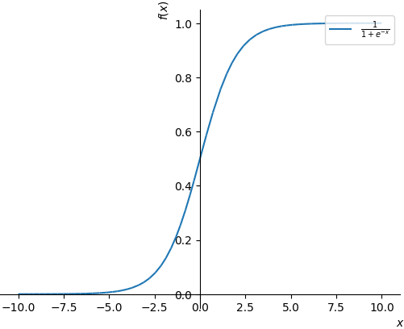
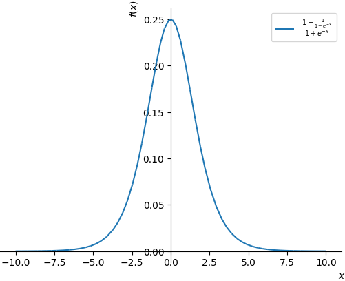

# Selbsttestfragen

Nachfolgende Fragen eigenen sich zur Prüfungsvorbereitung mittels **Active Recall** gedacht und eine Ergänzung zu Karteikarten.

Offizielle Fragen sind mit 🧠 markiert. Probeklausurfragen mit einem 🦧. Fragen der University of Berkley mit 🧑‍🚒. Eigene Fragen haben keine Markierung.

## Linear Regression

* Under which assumptions is the least squares objective from linear regression equivalent to a maximum likelihood objective?🦧
  * Gaussian likelihood with linear mean and constant noise.
* Give the formula for ridge regression and explain its components.
* Give the formula for LASSO and explain its components.
* Compare Multiple Linear Regression to LASSO. Why is it desirable to penalize a Linear Regression model?
* Why do errors of a linear regression model have to be normally distributed?

## Linear Classification\*

* Write down the objective of linear binary logistic regression. The samples are given by $$x_{i}$$ and the labels by $$c_{i} \in\{0,1\}$$. How is $$p\left(c_{i} \mid \boldsymbol{x}_{i}\right)$$ assumed to be distributed in binary logistic regression?🦧
  * $$\operatorname{argmax}_{\boldsymbol{w}} \sum_{i=1}^{N} c_{i} \log \left(\sigma\left(\boldsymbol{w}^{T} \boldsymbol{x}_{i}\right)\right)+\left(1-c_{i}\right) \log \left(1-\sigma\left(\boldsymbol{w}^{T} \boldsymbol{x}_{i}\right)\right)$$ 
  * Logistic regression assumes $$p\left(c_{i} \mid x_{i}\right)$$to be Bernoulli distributed.

## Model Selection\*

* _Why is it a bad idea to evaluate your algorithm on the training set? 🧠_
  * It's important to use unseen data when evaluating an algorithm to prevent overfitting. 
  * One would have zero empirical risk but a very high true risk.
  * In the worst case an algorithm could learn the data by heart, perform well during testing and training but perform poorly on real unseen data.
* _What is the difference between true and empirical risk? 🧠_
  * **True risk** is the performance on a random testpoint $$(x,y)$$. True risk is unknown.
  * **Empirical risk** is the performance on the training set. Empirical risk can evaluated using training samples.
* _The true risk can be decomposed in which parts?🧠_
  * The true risk can be decomposed into:

    $$\underbrace{\mathbb{E}_{D_{n}}\left[\mathbb{E}_{x, y}\left[\left(\hat{f}_{D_{n}}(x)-\hat{f}_{*}(x)\right)^{2}\right]\right]}_{\text {Variance }}+\underbrace{\mathbb{E}_{x, y}\left[\left(\hat{f}_{*}(x)-f(x)\right)^{2}\right]}_{\text {Bias }^{2}}+\underbrace{\sigma^{2}}_{\text {noise }}$$
* _How is the bias and the variance of a learning algorithm defined and how do they contribute to the true risk?_🧠
  * **Variance**:
    * $$\mathbb{E}_{D_{n}}\left[\mathbb{E}_{x, y}\left[\left(\hat{f}_{D_{n}}(\boldsymbol{x})-\hat{f}_{*}(\boldsymbol{x})\right)^{2}\right]\right]$$ 
    * Variance is the difference between the estimates and the "best" estimates. Error depends on the number of data points that are available for training. It accounts for the limitations in the training data set.
  * **Bias**:
    * $$\mathbb{E}_{x, y}\left[\left(\hat{f}_{*}(\boldsymbol{x})-f(\boldsymbol{x})\right)^{2}\right]$$ 
    * Bias is the difference between the true function and the "best" estimate of the model. 
  * Bias, variance and noise sum up to the true risk.
* _What is the advantage/disadvantage of k-fold CV vs. the Hold-out method?🧠_
  * k-Fold CV uses the entire data set for training, as the $$k$$-th fold is used for testing and the remaining folds are used for training. This is less wasteful compared to the Hold-Out-method, where a certain percentage of the data is exclusively reserved for testing.
  * On the other hand, is k-Fold CV more computationally expensive as it requires $$k$$ iterations to train the model. It also leads to more stable results though. In comparsion the Hold-out-method is less computationally expensive, as it requires only one run. 
  * What is problematic about the hold-out method is, that unlucky splits might give misleading results.
* _Why does it make sense to penalize the norm of the weight vector?🧠_
  * Applying a penalty to large weight vectors helps to keep the parameters small. Which leads to a smoother function. 
  * Also, the complexity of the model is limited.
  * The larger $$\lambda$$, the less complex the final model will be.
* _Which norm can we use and what are the different effects?_
  * $$\ell_1$$ **penalty**: 
    * $$\operatorname{penalty}(\boldsymbol{\theta})=\|\boldsymbol{\theta}\|_{1}=\sum_{d}\left|\theta_{d}\right|$$ 
    * Introduces sparse solutions, that means some parameters can be 0. Suitable for feature selection.
    * Hard to optimize.
  * $$\ell_2$$ **penalty**:
    * $$\operatorname{penalty}(\boldsymbol{\theta})=\|\boldsymbol{\theta}\|_{2}=\sum_{d} \theta_{d}^{2}$$ 
    * Redundant parameters will be close to 0, but never 0.
    * Easy to optimize.
* _What is the effect of early stopping?_🧠
  * Early stopping prevents overfitting, as model is not trained to to the smallest training error. 
  * Further more, the model's complexity is limited. E. g. with Boosting approaches, one doesn't learn overly complicated trees.

## Nearest Neighbour Algorithms, Trees, and Forests\*

* _What we mean with non-parametric / instance-based machine learning algorithms?_🧠
  * Non-parametric ML algorithms are algorithms, that do not learn a parametric model, but store all the training data and use the training data to make predictions.
  * Examples include the $$k$$-nearest neighbour algorithm and the Gaussian processes.
* _How does_ $$k$$_-Nearest neighbour works?🧠_
  * To classifiy a new input vector $$x$$, we examine the $$k$$closest training data points to $$x$$\(that lie within a hypersphere\). 
  * We assign the class that is most frequent among those neighbours to the query point $$x$$.
* _Why is it hard to use for high-dimensional data?🧠_
  * $$k$$-Nearest neighbour is built around a distant-based measure. However, in a very high-dimensional space, most points are equally far appart from each other.
  * So the neighbourhood becomes large.
* _How to search for nearest neighbours efficiently?🧠_
  * It's convient to use a KD-tree as the data structure. The KD tree is balanced and performs binary splits on the feature space.
  * Searching goes like this:
    * Find region containing $$\boldsymbol{x}$$. Navigate starting from the root node to the child node containing $$\boldsymbol{x}$$.
    * Save region point $$\boldsymbol{x}^{*} = \boldsymbol{x}_{0}$$ as current best.
    * Move up tree and recursively search regions interesecting hypersphere $$S\left(\boldsymbol{x},\left\|\boldsymbol{x}-\boldsymbol{x}^{*}\right\|\right)$$. 
    * Update $$\boldsymbol{x}^{*}$$ if new nearsest neighbour has been found.
* _What is a binary regression/decision tree?🧠_
  * A binary decision tree is a tree that performs a binary split at each node. The predictor space is segmented into smaller regions. 
  * In case of regression trees the predicted value at a node is the average response variable of all observations within this node.
* _What are useful splitting criterions?🧠_
  * **For regression trees:** 
    * Minimum residual sum of squares: $$\mathrm{RSS}=\sum_{\text {left }}\left(y_{i}-\bar{y}_{L}\right)^{2}+\sum_{\text {right }}\left(y_{i}-\bar{y}_{R}\right)^{2}$$ 
  * **For classification trees:**
    * Information gain / Minimum entropy: $$N_{L} H\left(p_{\mathrm{L}}\right)+N_{R} H\left(p_{\mathrm{R}}\right)$$ 
* _How can we influence the model complexity of a tree?_🧠
  * One can limit the depth of the tree or limit the minimum number of samples that must be present within one node.
  * Another way is to apply pruning to a decision tree, which refers to cutting back a fully grown tree.
* _Why is it useful to use multiple trees and randomization?_🧠
  * Decision Trees are prone to overfitting. That's why we should learn several trees to increase variability.
  * By randomizing the features and combining the trees \(random forest\) or learning several trees on bootstrap samples \(bagging\) one can prevent trees from overfitting.
* Name at least two advantages and two disadvantages of decision trees. 🦧
  * **Advantages**:
    * Easy to interpret \(if they are small\)
    * Computionally efficient. They are quick to fit, even for large problems.
  * **Disadvantage**:
    * Other ML methods such as NN achieve a better accuracy.
    * Suffer from instability, if we change the data, ever-so-slightly trees can change a lot. 
* _Which data structure is usually used to efficiently implement k-Nearest Neighbours? Name the main steps in building that data structure._🦧
  * KD-Trees are commonly used.
  * Building the tree:
    * choose dimension \(e. g. longest hyper-rectangle\)
    * Choose median as pivot
    * Split node according tho chosen pivot and dimension.

## Clustering\*

* _How is the clustering problem defined?🧠_
  * Clustering tries to find a natural grouping within the data.
  * One tries to maximize the intra-cluster similarity and minimize the inter-cluster similarity.
* _Why is it called 'unsupervised'?🧠_
  * It's called unsupervised, as the data is unlabeled. There is no supervisor, that tells us in advance to which cluster a training data point belongs. Hence, unsupervised. The structure is actually learned from the data. 
* _How do hierarchical clustering methods work?_ 🧠
  * **Init-phase:** Each of the $$n$$samples becomes a cluster itself
  * **Iterate-phase:** 
    1. Find closest clusters and merge them
    2. Proceed until we have a single cluster
* _What is the rule of the cluster-2-cluster distance and which distances can we use?_🧠
  * So called cluster linkage types define the distance between two clusters. Commonly used are
    * Single linkage
    * Complete linkage
    * Average linkage
    * Centroid linkage
* _How does the_ $$k$$_-mean algorithm work? What are the two main steps?_🧠
  * The two main steps are the **assigment** and **adjustment step**.
  * **Assignment step:** 
    * Assign each sample to its closest centroid $$z_{n}=\arg \min_{k}\left\|\boldsymbol{c}_{k}-\boldsymbol{x}_{n}\right\|^{2}$$ 
  * **Adjustment Step:**
    * Adjust the centroids to be the means of the samples assigned to them: $$c_{k}=\frac{1}{\left|X_{k}\right|} \sum_{\boldsymbol{x}_{i} \in X_{k}} \boldsymbol{x}_{i}, \quad X_{k}=\left\{\boldsymbol{x}_{n} \mid z_{n}=k\right\}$$ 
* _Why does the algorithm converge? What is it minimizing?_🧠
  * $$k$$-means minimizes the Sum of Squared Distances \(SSD\). By checking, if a cluster centeroids exists, that is closer to a point than its current cluster centroid the SSD is reduced. If no closer custer centre exists and the SSD remains constant.
  * SSD is defined as $$\operatorname{SSD}(C ; \mathcal{D})=\sum_{i=1}^{n} d\left(\boldsymbol{x}_{i}, c\left(\boldsymbol{x}_{i}\right)\right)^{2}$$ 
* _Does_ $$k$$_-means find a global minimum of the objective?🧠_
  * No, generally it doesn't. Finding a global minimum is a NP-hard problem. One would have to check all assignments to find the global best solution.
  * More over, the result of $$k$$-means is heavily dependent on the initialisation.

## Dimensionality Reduction

* What does dimensionality reduction mean?🧠
* What is PCA? 🧠
* What are three things that it does?🧠
* What are the roles of the Eigenvectors and Eigenvalues in PCA?🧠
* Can you describe applications of PCA?🧠
* Why should each dimension have a unit variance / be normalized?

## Density Estimation and Expectation Maximization

* What are parametric methods and how to obtain their parameters?🧠
* How many parameters have non-parametric methods?🧠
* What are mixture models?🧠
* Should gradient methods be used for training mixture models?🧠
* How does the EM algorithm work?🧠
* What is the biggest problem of mixture models?🧠
* How does EM decomposes the marginal likelihood?🧠
* Why does EM always improve the lower bound?🧠
* Why does EM always improve the marginal likelihood?🧠
* Why can we optimize each mixture component independently with EM?🧠
* Why do we need sampling for continuous latent variables?🧠

## Kernel methods\*

* What is the definition of a kernel and its relation to an underlying feature space?🧠
  * Let $$\phi: \mathcal{X} \rightarrow \mathbb{R}^{d}$$ be an arbitrary feature function, then $$k\left(\boldsymbol{x}, \boldsymbol{x}^{\prime}\right)=\left\langle\phi(\boldsymbol{x}), \boldsymbol{\phi}\left(\boldsymbol{x}^{\prime}\right)\right\rangle$$ defines a positive definite kernel.
* Why are kernels more powerful than traditional feature-based methods?🧠
  * Traditional feature-based methods require working in the higher-dimensional feature space, while kernel-based methods do not.
* What do we mean by the kernel trick?🧠
  * Kernel methods allow to calculate the dot product in a high-dimensional feature space without ever computing the mapping $$\phi$$ of the data in that space. Instead of applying the transformations of $$\phi (x)$$explicitly, the computation is done in the lower-dimensional feature space by replacing the inner product with a function.
* How do we apply the kernel trick to ridge regression?🧠
  * The ridge solution is given by: $$\boldsymbol{w}_{\text {ridge }}^{*}=\underbrace{\left(\Phi^{T} \Phi+\lambda \boldsymbol{I}\right)^{-1}}_{d \times d \text { matrix inversion }} \boldsymbol{\Phi}^{T} \boldsymbol{y}$$ 
  * By applying the "searle set of identies" \( $$(\boldsymbol{I}+\boldsymbol{A} \boldsymbol{B})^{-1} \boldsymbol{A}=\boldsymbol{A}(\boldsymbol{I}+\boldsymbol{B} \boldsymbol{A})^{-1})$$ we get:
  * $$\boldsymbol{w}^{*}=\underbrace{\left(\boldsymbol{\Phi}^{T} \boldsymbol{\Phi}+\lambda \boldsymbol{I}\right)^{-1}}_{d \times d \text { matrix inversion }} \boldsymbol{\Phi}^{T} \boldsymbol{y}=\boldsymbol{\Phi}^{T} \underbrace{\left(\Phi \Phi^{T}+\lambda \boldsymbol{I}\right)^{-1}}_{N \times N \text { matrix inversion }} \boldsymbol{y}$$
  * The kernelized version is then given by: $$\boldsymbol{w}^{*}=\boldsymbol{\Phi}^{T} \underbrace{(\boldsymbol{K}+\lambda \boldsymbol{I})^{-1} \boldsymbol{y}}_{\alpha}=\mathbf{\Phi}^{T} \boldsymbol{\alpha}$$ 
* Study the kernel properties, where is symmetry relevant? Where and why is positive definiteness of matrix important?
  * Inner products are symmetric and strictly positive definite. \(see [here.](https://ocw.mit.edu/courses/sloan-school-of-management/15-097-prediction-machine-learning-and-statistics-spring-2012/lecture-notes/MIT15_097S12_lec13.pdf)\) Thus, a function substituting the product aka kernel has to fullfill the same properties.
* What is the impact of changing $$\sigma$$ in a RBF kernel?
  * Recall the RBF kernel is given by $$k(\boldsymbol{x}, \boldsymbol{y})=\exp \left(-\frac{\|\boldsymbol{x}-\boldsymbol{y}\|^{2}}{2 \sigma^{2}}\right)$$.
  * If the distance between $$\boldsymbol{x}- \boldsymbol{y}$$is large, $$\exp$$will be small, this means training observations $$\boldsymbol{x}$$will hardly play any role in the prediction of  test observation $$\boldsymbol{y}$$.
  * The $$\sigma$$now controls the width of the neighbourhood or the variance of the Gaussian density.
* What is the actual gain from using polynomial kernels?
  * By using a polynomial kernel with $$d>1$$one gets a more flexible decision boundary. This is comparable to fitting e. g. a classifier in a higher dimensional feature space.
* What is the purpose of the kernel matrix?
  * A kernel matrix is built by evaluating the kernel on all pairs and any set inputs. So it stores the similarities of all samples.
  * $$[\boldsymbol{K}]_{i j}=\boldsymbol{\phi}\left(\boldsymbol{x}_{i}\right)^{T} \boldsymbol{\phi}\left(\boldsymbol{x}_{j}\right)=k\left(\boldsymbol{x}_{i}, \boldsymbol{x}_{j}\right)$$
* Proof that the a positive definite Kernel is symmetric.
  * $$k\left(\boldsymbol{x}, \boldsymbol{x}^{\prime}\right)=\left\langle\boldsymbol{\phi}(\boldsymbol{x}), \boldsymbol{\phi}\left(\boldsymbol{x}^{\prime}\right)\right\rangle = \left\langle\boldsymbol{\phi}(\boldsymbol{x}^{\prime}), \boldsymbol{\phi}\left(\boldsymbol{x}\right)\right\rangle = k\left(\boldsymbol{x}^{\prime}, \boldsymbol{x}\right)$$ 

## SVMs\*

* Why is it good to use a maximum margin objective for classification?🧠
  * The maximum margin objective is good for classification, as it tries to find the hyperplane that gives the greatest minium distance to the closest observations.
  * The intutition is, that if less observations next to the decision boundary, the results are less uncertain.
* How can we define the margin as an optimization problem?
  * It can be formulated as:
    * $$\begin{aligned} \operatorname{argmax}_{\mathbf{w}} & \frac{2}{\|\mathbf{w}\|}, \\ \text { s.t. } & \mathbf{w}^{T} \mathbf{x}_{i}+b\left\{\begin{array}{l} \geq+1, \quad \text { falls } y_{i}=+1 \\ \leq-1, \quad \text { falls } y_{i}=-1 \end{array}\right. \end{aligned}$$
* What are slack variables and how can they be used to get a 'soft' margin?🧠
  * A ''soft' margin is the concept of a hyperplane, where almost all observations are separted correctly. This is done through so called slack variables $$\xi_i$$, that allow violating the margin. We use slack variables $$\xi_i \geq 0$$ and allow for margin violations: $$y_{i}\left(\mathbf{w}^{T} \mathbf{x}_{i}+b\right) \geq 1-\xi_{i}$$.
* How is the hinge loss defined?🧠
  * $$\operatorname{argmin}_{\mathbf{w}} \lambda \underbrace{\|\mathbf{w}\|^{2}}_{\text {regularization }}+\underbrace{\sum_{i=1}^{N} \max \left(0,1-y_{i} f\left(\boldsymbol{x}_{i}\right)\right)}_{\text {data loss }}, \quad \text { with } \lambda=\frac{1}{C}$$ 
* What is the relation between the slack variables and the hinge loss?🧠
  * If $$\xi_i$$is $$>1$$, the point lies outside the margin, but doesn't contribute to the loss.
  * If $$\xi_i$$is $$0 \leq \xi_{i} \leq 1$$, it violates the margin and contributes to the loss.
  * If $$\xi_i$$is $$0$$, it's a support vector.
* What are advantages and disadvantages in comparison to logistic regression?🧠
  * Logistic regression doesn't allow for margin valuations. SVMs however, allow some observations to lie on the wrong side oft the margin through the notion of slack variables.
  * Logistic regression retursn probabilities. SVMs do not.
  * Logistic regression is more sensitive to outliers, whereas SVMs find a more balanced decision boundary.
* What is the difference between gradients and sub-gradients?🧠
  * In order to calculate the gradient of a function, the function has to be differentiable.
  * To calculate sub-gradients the function has to be convex, but not necessarily differentiable. 
  * The sub-gradient is similar to a piece-wise gradient. 
* First, explain the intuition behind slack-variables in support vector machine training. Second, for a single data-point $$\left(\boldsymbol{x}_{i}, c_{i}\right)$$ the margin condition with slack variable $$\xi_{i}$$ is given as

  $$
  c_{i}\left(\boldsymbol{w}^{T} \boldsymbol{x}_{i}+b\right) \geq 1-\xi_{i}
  $$

  * Assuming $$0 \leq \xi_{i} \leq 1$$, is $$\boldsymbol{x}_{i}$$ classified correctly?
  * Assuming $$\xi_{i}>1$$, is $$x_{i}$$ classified correctly?🦧
    * Slack variables $$\xi_i$$allow for a a margin violation. That means some observation can lie across the margin, but in between the decision boundary or even on the wrong side of the decision boundary.
    * It acts as a regularization term.
    * It helps to find a optimal hyperplane if a maximum margin hyperplane can otherwise not be found.
    * In the first case above, the observation is classified correctly but violates the margin. The second observations is classified flasly and contributes to the loss.

## Bayesian Learning

* What are the two basic steps behind Bayesian Learning?🧠

  1. Compute the posterior: $$\underbrace{p(\boldsymbol{\theta} \mid \mathcal{D})}_{\text {posterior }}=\frac{\overbrace{p(\mathcal{D} \mid \boldsymbol{\theta})}^{\text {data likelihood}} \overbrace{p(\boldsymbol{\theta})}^{\text {prior }}}{\underbrace{p(\mathcal{D})}_{\text {evidence }}}$$ 

      That is, compute posterior over parameters / models.

  1. Integrate out posterior: $$\underbrace{p\left(\boldsymbol{x}^{*} \mid \mathcal{D}\right)}_{\text {marginal likelihood }}=\int \underbrace{p\left(\boldsymbol{x}^{*} \mid \boldsymbol{\theta}\right)}_{\text {likelihood }} \underbrace{p(\boldsymbol{\theta} \mid \mathcal{D})}_{\text {posterior }} d \boldsymbol{\theta}$$ 

     Average over all parameters / models weighted by the posterior.

* Why is Bayesian Learning more robust against overfitting?🧠
  * Instead of choosing a single estimate for the parameter vector, we estimate a probability distribution for the parameter vector $$\boldsymbol{\theta}$$. As multiple  estimates are incorporated in the averaged parameter vector the model becomes more robust.
* What happens with the posterior if we add more data to the training set?🧠
  * For very large datasets the posterior will be a **point estimate**. Baysian learning will be equivalent to maximum likelihood solution.
* What is completing the square and how does it work?🧠
  * TODO:
* _For which 2 cases can Bayesian Learning be solved in closed form?_🧠
  * linear feature / kernelized regression models
* _Which approximations can we use if no closed form is available?_
  * Monte-Carlo Markov Chain sampling \(not covered\)
  * Laplace approximation \(not covered\)
* How can we derive Bayesian Linear regression?🧠
  * TODO:
* _What is the advantage of Bayesian Linear Regression over Ridge regression? What is the conceptual difference?_🧠
  * The solution of ridge regression and the Bayesian Linear Regression is identical.  
  * One advantage is, that we have uncertainty estimates for the parameter vector. 
  * They are identicial in a way that the posterior mean is identical to the ridge solution for linear models. 
  * The difference is that that for the Bayesian Linear Regression the variance is now input-dependent.
* What is the major advantage of Gaussian processes over kernel ridge regression?🧠
* Why are GPs a Bayesian approach?🧠
* What principle allowed deriving GPs from a Bayesian regression point of view?🧠
* Gaussian Processes\(GP\) are also referred to as a "Bayesian Kernel Regression" approach. Why? 🦧

## Neural Nets

* How does logistic regression relate to neural networks?🧠
  * logistic regression can be considered as a special case of neural nets. Namely, a net with a sigmoid activation function and one layer \(no hidden layer\).
* _What kind of functions can single-layer neural networks learn?🧠_
  * As stated in the universal function approximation theorem, a single-layer neural net is sufficent to learn an arbitrary function given an infinite amount of units. 
* Why do we need non-linear activation functions?🧠
  * In order to compute interesting functions we need non-linear activation functions. 
  * Independent of the number of layers by using a linear activation function we can only compute a linear activation function. This is due to the fact that a composition of linear function itself is a linear function. \(see [here.](https://www.coursera.org/lecture/neural-networks-deep-learning/why-do-you-need-non-linear-activation-functions-OASKH)\)
* What activation functions can we use and what are the advantages/disadvantages of those?🧠
  * \(see anki deck\)
* What output layer and loss function to use given the task \(regression, classification\)?🧠
  * **regression**: linear layer, squared error \(deterministic\)
  * **classification**: sigmoid, negative loglikelihood \(probabilistic\)
* Why not use a sigmoid activation function?🧠
  * sigmoid function leads to vanishing gradients \(see below\)
  * sigmoid function is non-zero centered as the range is $$[0,1]$$. 
  * $$\exp$$is expensive to calculate, esspecially in deep networks.
* Derive the equations for forward and backpropagation for a simple network.🧠
  * \(see anki deck\)
* What is mini-batch gradient descent? Why use it instead of stochastic gradient descent or full gradient descent?🧠
  * Mini-batch gradient is a variant of Gradient Descent optimized for the calculation on the GPU. The data is split into smaller, equally sized chunks so-called minibatches. The mini-batches are then used to calculate the gradient and weights are updated. The results of the individual batches are combined through summation. \(see Zhang et al\)
* _Why neural networks can overfit and what are the options to prevent it?_🧠
  * Use early stopping with cross-validation
    * Use network pruning → A kind of regularization, where the complexity of the network is reduced in order to reduce the generalization error. 
    * Standard ways to limit the capacity of a neural net
      * limit number of hidden parameters 
      * limit the size of weights
* _Why is the initialization of the network important?🧠_
  * A poor initialization can lead to a slow learning of the network.
  * Moreover, if all the neurons are initialized identically the network will not learn unique features, as all gradients are the same.
* _What is a typical goal of \(good\) weight initialization? 🧑‍🚒_
  * Gradients should not vanish / decay to zero or be overly saturated. Moreover, they should be non-zero.
  * One good approach is Xavier initalization.
* What can you read from the loss-curves during training \(validation and training loss\)?🧠
  * See whether a network overfits. This is the case if training error decreases but training error doesn't decrease, so test and trainings error diverge.
  * If training should be continued or not, if e. g. loss no longer improves the training should be aborted.
  * If training and test loss are very close, this could be a sign of underfitting.
  * Poor initalization, if loss decreases late.
  * If learning rate should be changed.
* _How can we accelerate gradient descent?🧠_
  *  Adaptive learning rate
  * Introduce a momentum term
  * Second order methods
* _How does Adam work?🧠_
  * TODO:
* _What is the key idea behind second-order optimization methods? What are their benefits? Why are second-order optimization methods usually not applicable for Deep Neural Networks? 🦧_
  * The idea of second-order optimization methods is to directly step to the minimum of the quadratic approxmation by calculating the second order derivatives Hessian.
  * No learning rat needs to be tuned and they need fewer function evaluations.
  * It's not applicable to Deep Neural Networks, as the Hessian becomes large and needs to be inverted \(also see below\). 
* Second-order optimization methods are rarely used for deep neural network optimization. Why? 🧑‍🚒
  * Second-order optimization methods require the calculation of the Hessian and the inverse. However calculating the Hessian is $$\mathcal{O}(N^2)$$and the inverse is $$\mathcal{O}(N^3)$$ for $$N$$dimensions.
* _Explain why sigmoid activation results tend to be almost_ $$0$$ _or_ $$1$$?

  * The sigmoid function is bound by th exponential component, so that the range is $$[0,1]$$.

* **Considering gradients:** The sigmoid activation function is prone to vanishing gradients, as the gradient is smaller than $$\leq 0.25$$. Multiplying the gradients several times will soon lead to gradients close to zero.

 

* Adding more hidden layers will solve the vanishing gradient problem for a two-layer neural network. True / False?🧑‍🚒
  * No, as a deeper network will increase the chance of vanishing gradients, as they have to be backpropated.
* _Adding L2-regularization will help with vanishing gradients? True / False?_ 🧑‍🚒
  * False, as $$\ell_2$$regularization pulls the weights towards zero, meaning the vanishing gradient problem could become worse.
* Early stopping, cross-validation, and network pruning are techniques to prevent overfitting of Neural Nets. Explain them. 
  * Early stopping: \(see below\)
  * cross-validation: cross-validation means splitting the data set into $$k$$folds. The $$k$$th fold is used for validation, while the remaining folds are used for testing. As the training uses $$k$$passes and combines the resulting neural nets, the results is less prone to overfitting.
  * network pruning: \(see below\)
* _For a fully-connected deep network with one hidden layer, increasing the number of hidden units should have what effect on bias and variance?_ 🧑‍🚒
  * Increasing the number of hidden units, while keeping the training dataset constant will lead to overfitting, meaning a small bias, but high variance.
* _What is the problem of Neural nets with many parameters?_
  * Large neural networks tend to overfit, as one can learn an arbitrary function given that the network has enough capacity. 
  * We need a lot of samples.
* _Explain what network pruning is._
  * Network pruning refers the process of systematically removing parameters from a neural network to limit the computational demand and maintain accuracy.
* _Explain how early stopping works with Neural Nets._
  * With early stopping one doesn't train a neural network until the training error is most most minimal, but rather uses the improvement of the validation error to decide when to stop training. The parameters are used, when the validation error has not improved for some time. \(see Goodfellow p. 143\)

##  CNNs\*

* Why are fully connected networks for images a bad idea and why do we need images?🧠
  * Spatial structure of image is not preserved, as image must be flattened to an array to be used as an input. However, we want to keep neighbouring pixels together, as they are more correlated.
  * Training a fully-connected network with large number of inputs requires many parameters / weights. 
  * **Example:** A fully-connected layer with a thousand hidden dimensions and an input image of 1 Megapixel would require one billion parameters. \(Zhang et al. Dive into Deep Learning\)
* What are the key components of a CNN?🧠
  * **Convolutional layer:** A convolutional layer cross-correlates the input and kernel and adds a bias to produce an input. This is used to extract different features.
  * **Pooling layer:** Pooling layer make representations smaller and more managable. They serve the dual purpose of mitigating the **sensitivity** of convolutional layers **to location** and of spartially downsampling representations \(Zhang et al. Dive into Deep Learning\)
  * **Activation function:** After every convolutional operation a non-linear operations e. g. ReLU is applied to replace negative values.
* What hyper-parameters can we set for a convolutional layer and what is their meaning?🧠
  * $$K$$ Number of Filters / Spacial extend
  * $$S$$Stride or step size of slided window
  * $$F$$Kernel size
  * $$P$$Amount of padding added
* What hyper-parameters can we set for a pooling layer and what is their meaning?🧠
  * $$S$$Stride or step size of sliding window
  * $$F$$kernel size / Spacial extend
* How can we compute dimensionality of the output of a convolutional layer?🧠
  * $$W=\left(W-F+2 P\right) / S+1$$ 
  * $$H=\left(H-F+2 P\right) / S+1$$ 
  * $$D=K$$ 
* Describe basic properties of LeNet.
  * LeNet consist of two parts:
    * A convolutional encode consisting of two convolutional layers.
    * A dense block of three fully-connected layers.
  * The convolutional blocks are a convolutional layer, a sigmoid activation function and an average pooling operation. The convolutional layer use a $$5\times5$$kernel and a sigmoid activation function. The pooling operation uses a $$2\times2$$using a stride 2. \(Zhang et al. Dive into Deep Learning\)
* Describe basic properties of 'AlexNet' and 'VCG'.🧠
  * **AlexNet**:
    * AlexNet consists of 8 layers, which means it's deeper than LeNet. The 8 layers consists of five convolutional layers, two fully connected hidden layers and one-fully connected output layer.
    * The convolutional window is of shape $$11 \times 11$$in the first layer and $$5 \times 5$$in the second layer and several $$3 \times 3$$. 
    * The pooling layers have a window shape of $$3 \times 3$$and a stride of 2.
    * AlexNet used the ReLU activation function.
  * **VCG**:
    * VCG consists of 16-19 layer.
    * Convolutional layers have a window size of $$3 \times 3$$and a stride of 1 and padding of 1.
    * The pooling layers have a window shape of $$2 \times 2$$ and a stride of 2.
    * VCG used the ReLU activation function.
* What is the main idea of 'ResNet' to make it very deep?🧠
  * ResNet uses 152 layers. 
  * ResNet utilizes so-called residual blocks / residual layers.
* What are **residual layers** in a ResNet model?
  * One can either learn the underlying mapping by learning $$f(\boldsymbol{x})$$or by learning a so-called residual mapping $$f(\boldsymbol{x}) - \boldsymbol{x}$$ and combining it with the identity mapping. The later is easier to learn. 
  * **Example**: If one has to learn the identity function it is as simple as pushing the weights and bias through the layers.
  * As an advantage with residual blocks inputs can forward propagate faster through the residual connections across layers. \(Zhang et al. Dive into Deep Learning\)
* What is the idea of bottleneck layers with **ResNet**?
  * Instead of using two layers for a residual function $$\mathcal{F}$$, they use a 3 layer design consisting of a $$1 \times 1$$, $$3 \times 3$$ and $$1\times1$$convolution. The $$1\times1$$layers are responsible for reducing and increasing the dimensions, as they preserve the dimension. Where the $$3 \times 3$$layer acts like a bottleneck. \(see [here.](https://arxiv.org/pdf/1512.03385.pdf)\)
* Why is it not feasible to use a fully connected layer for images? How do convolutional neural networks solve this problem and which property of an image do they exploit?🦧
  * They have to many parameters.
  * They have less parameters due to sharing the parameters.
  * They exploit the spatial structure of the image.

## RNNs\*

* How do LSTMs actually avoid the vanishing gradient problem?
  * In order to calculate the hidden state $$h_t$$, RNNs require multiplication with the weight matrix $$\boldsymbol{W}$$multiple times and application of the $$\tanh$$. If Eigenvalues are small, gradients tend to become small as well.
  * The vanishing gradient problem is solved by LSTMs, as the the calculation of the cell state $$c_t$$ requires only a hadamard product with $$f$$, but not matrix multiplication with the weight matrix $$\boldsymbol{W}$$.

## General

* What is the difference between AI and ML?
* What are the hyperparameters for choosing the model complexity for each of the following algorithms. Name at least one hyperparameter for every algorithm.
  * Neural Networks
  * Support Vector Machines
  * Gaussian Processes
  * Decision Trees? 🦧
* You are given the following optimization problem:

  $$
  \begin{aligned}
  &\underset{a}{\operatorname{argmax}} a^{2} h \\
  &\qquad \text { s.t. } S_{\max } \geq 2 a^{2}+4 a h
  \end{aligned}
  $$

  Write down the Lagrangian. Derive the optimal value for $$a$$ depending on your lagrangian multiplier. 🦧

