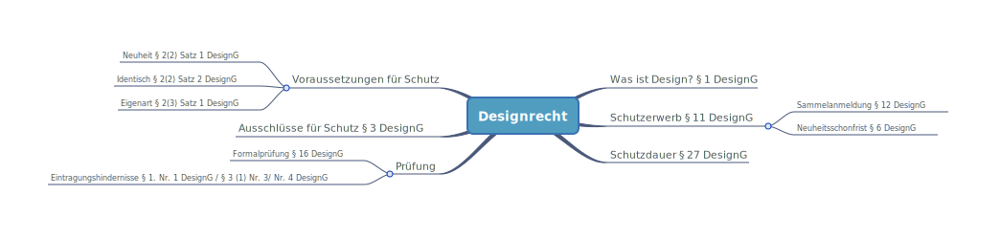

# Designrecht

### 🗺️Paragraphenübersicht

### Begriffsbestimmung Design

* Geregelt in [§ 1 DesignG](https://www.gesetze-im-internet.de/geschmmg_2004/__1.html)
* Ein Design ist die zweidimensionale oder dreidimensionale Erscheinungsform eines ganzen Erzeugnisses oder eines Teils davon, die sich insbesondere aus den Merkmalen der Linien, Konturen, Farben, der Gestalt, Oberlächenstruktur oder der Werkstoffe des Erzeugnisses selbst oder seiner Verzierung ergibt.

### Voraussetzung für Schutz

* **Neuheit**: Es darf vor dem Anmeldetag kein identisches Design offenbart worden sein \(§ 2\(2\) Satz 1 DesignG\)
* **Identisch:** Wenn sich ihre Merkmale nur in unwesentlichen Einzelheiten unterscheiden \(§ 2\(2\) Satz 2 DesignG\).
* **Eigenart:** 

  * Geregelt in [§ 2 \(3\) Satz 1 DesignG](https://www.gesetze-im-internet.de/geschmmg_2004/__2.html).
  * Wenn sich der Gesamteindruck, den es beim **informierten Benutzer** hervorruft, von dem Gesamteindruck des vorbekannten Designs utnerscheidet.
  * Informierter Benutzer is ähnlich zum Vekehrskreis bei Markenrecht.
  * Voraussetzungen sind im Vergleich zu den Ansprüchen des Urheberrechts geringer.

### Ausschlüsse vom Design-Schutz

* Geregelt in [§ 3 DesignG](https://www.gesetze-im-internet.de/geschmmg_2004/__3.html).

1. Erscheinungsmerkmale von Erzeugnissen, die ausschließlich durch deren technische Funktion bedingt sind.
2. **Lego-Klausel = Must-Fit-Teile**: Erscheinungsmerkmale von Erzeugnissen, die zwangsläufig in ihrer genauen Form und ihren genauen Abmessungen nachgebildet werden müssen.
3. Ausnahme von Nr. 2 = **Must-Match-Teile**: 
   * Wenn sie dem Zweck dienen, den Zusammenbau oder die Verbindung einer Vielzahl von untereinander austauschbaren Teilen innerhalb eines Bauteilesystems zu ermöglichen
   * **Beispiel:** KFZ-Ersatzteile

### Schutzerwerb

* Geregelt in [§ 11 DesignG](https://www.gesetze-im-internet.de/geschmmg_2004/__11.html)
* Hinterlegung beim Deutschen Patent- und Markenamt
* Benötigt wird eine zur Bekanntmachung geeignete Wiedergabe des Designs
  * Grundsatz der Bildwiedergabe z. B. Zeichnung oder Foto
  * Reproduktionseignung
  * Schwarzweiß / Farbe
  * neutraler Hintergrund
  * Frei von Beiwerk z. B. alles Beiwerk würde sonst Schutzgegenstand werden.
* Klassifikation erfolgt nach Lacarno-Klassifikation.
* Es lassen sich mehrere Design-Anmeldungen zusammenfassen zu einer **Sammelanmeldung** \([§ 12 DeisgnG](https://www.gesetze-im-internet.de/geschmmg_2004/__12.html) \)
* Es gibt **Neuheitsschonfrist** gem. [§ 6 DesignG](https://www.gesetze-im-internet.de/geschmmg_2004/__6.html). Man kann also noch ein Design anmelden, obwohl es bereits max. 6 Monate der Öffentlichkeit bekannt gemacht wurde. Gilt nicht für alle Länder.

### Prüfung

* Reine Formalprüfung nach § 16 DesignG.
* Prüfung erfolgt auf Eintragungshindernisse gem. [§ 1 Nr. 1](https://www.gesetze-im-internet.de/geschmmg_2004/__1.html) DesignG  und [§ 3 \(1\) Nr. 3/ Nr. 4 DesignG](https://www.gesetze-im-internet.de/geschmmg_2004/__3.html).
* Bekanntmachung durch Wiedergabe des Deisgns.

### Nichtigkeitsverfahren

* Geregelt in [§ 33 ff DesignG](https://www.gesetze-im-internet.de/geschmmg_2004/__33.html)
* Amtsverfahren vor dem DPMA oder
* Gerichtsverfahren durch Widerklage im Verletzungsverfahren

### Anmeldemöglichkeiten

* Schutz für DE: DPMA
* Schutz für EUROPA: EUIPO
* Schutz für Teile der EU + ggf. EU-Ausland: IR-Muster \(HMA\) und / oder ggf. nationale Anmeldung

### Unterschied Design-Schutz und Urheberrecht

* Design-Schutz wird für max. 25 Jahre \(5x5 Jahre\) ab Eintragung gewährt gem. [§ 27DesignG](https://www.gesetze-im-internet.de/geschmmg_2004/__27.html)
* Urheberrecht gilt bis 70 Jahre nach dem Tod gem. [§ 64 / 65 UrhG](https://www.gesetze-im-internet.de/urhg/__64.html)

