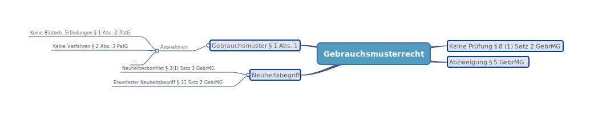

# Gebrauchsmusterrecht

## 🗺️Paragraphenübersicht

## Überblick

* Gebrauchsmusterrecht existiert auf nationaler Ebene. Es gibt kein EP- oder EU Pendant.
* Es ist ein technisches Schutzrecht / Ausschließlichkeitsrecht wie Patent
* Häufig als "kleines Patent" bezeichnet.
* Ursprünglich wurde ein physisches Modell des kleinen Gegenstands beim Patentamt hinterlegt.
* Laufzeit von max. 10 Jahren \(3 + 3 + 2 +2\)
* Einfach zu erwerben, weil gem [§ 8 \(1\) Satz 2 GebrMG](https://www.gesetze-im-internet.de/gebrmg/__8.html) keine Prüfung erfolgt auf:
  * Neuheit
  * erfinderischen Schritt 
  * gewerbliche Anwendbarkeit
* Gleicher Schutzumfang wie Patent.

## Gebrauchsmuster

* Geregelt in [§ 1 Abs. 1](https://www.gesetze-im-internet.de/gebrmg/__1.html)
* Als Gebrauchsmuster werden Erfindungen geschützt, die neu sind, auf einem **erfinderischen Schritt** beruhen und gewerblich anwendbar sind.
* Erfinderisches Schritt und erfinderische Tätigkeit heute etwa gleich. 🤝
* **Nicht** Gebrauchsmuster kann sein:
  * Entdeckungen sowie wissenschaftliche Theorien und mathematische Methoden
  * ästhetische Formschöpfungen
  * Pläne, Regeln und Verfahren für gedankliche Tätigkeiten, ... Programme für Datenverarbeitungsanlagen
  * die Wiedergabe von Informationen
  * Kein Schutz von biotechnologische Erfindungen \([§ 1 Abs. 2 PatG](https://www.gesetze-im-internet.de/patg/__1.html)\)

## Unterschied zum Patent:

* Kein Schutz von biotechnologische Erfindungen \([§ 1 Abs. 2 PatG](https://www.gesetze-im-internet.de/patg/__1.html)\)
* Kein Schutz von **Verfahren** im Unterschied zum Patent. \([§ 2 Abs. 3 PatG](https://www.gesetze-im-internet.de/gebrmg/__3.html)\)
* Gebrauchsmuster hat **Neuheitsschonfrist**: 
  * Geregelt in [§ 3\(1\) Satz 3 GebrMG](https://www.gesetze-im-internet.de/gebrmg/__1.html).
  * Eine innerhalb von 6 Monaten vor der Anmeldung erfolgte Beschreibung bleibt außer Betracht, wenn sie auf der Ausarbeitung des Anmelders oder seines Rechtsvorgängers beruht.
* **Erweiterter Neuheitsbegriff**
  * Geregelt in § 31 Satz 2 GebrMG.
  * Der Stand der Technik umfasst alle Kenntnisse, die vor dem für den Zeitrang der Anmeldung maßgeblichen Tag durch schriftliche Beschreibung oder durch eine im Geltungsbereich dieses Gesetzes erfolgte Benutzung der Öffentlichkeit zugänglich gemacht wurden.
  * Reine Benutzungen im Ausland sind nicht maßgeblich.
* Gem **Abzweigung** \([§ 5 GebrMG](https://www.gesetze-im-internet.de/gebrmg/__5.html)\) kann man für Gebrauchsmusteranmeldung den früheren Anmeldetag einer Patentanmeldung in Anspruch nehmen \(Bedingungen gelten\). Pioritätsrecht bleibt erhalten.

## Gegenüberstellung Patent vs. Gebrauchsmuster

|  | Patent | Gebrauchsmuster |
| :--- | :--- | :--- |
| Verfahrensschutz | Ja | Nein |
| Neuheitsschonfrist | Nein | Ja |
| Vorbenutzung Ausland | Neuheitsschädlich | Nicht neuheitsschädlich |
| Maximale Laufzeit | 20 Jahre | 10 Jahre |
| Nationale Phase aus PCT | Ja | Ja |
| Materielle Prüfung | Ja | Nein |
| Recherche | Ja | Optional |
| Umwandlung aus EP | Nein | Abzweigung |
| Anspruchsgebühren | Ab 10 Patentansprüche kostenpflichtig | Nein |

