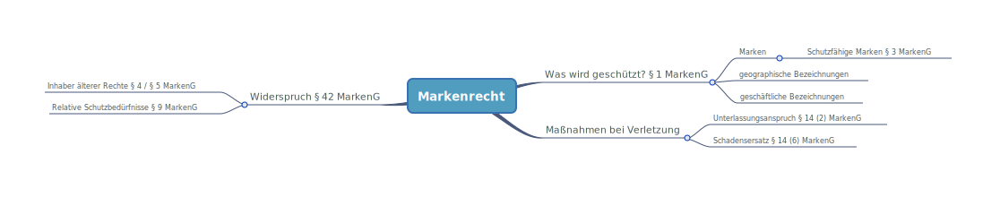

# Markenrecht

### 🗺️Paragraphenübersicht

### Historie

* 1874 trat Gesetz für Markenschutz in Kraft. Damals bestand aber noch kein Patentamt. Eintragung erfolgte bei Handelsregister.
* 1894 trat Gesetz zum Schutz von Warenbezeichnungen. Es erfolgte dann Eintragung beim kaiserlichen Patentamt.
* Ab 1995 war Eintragung einer Hörmarke, Farbmarke etc. möglich. 

### Überblick

* **Bildmarke**: z. B. Schwerter der  Porzellanmanufaktur Meißen
* **Wort-Bildmarke** z. B. Apollinaris
* **Wortmarke** z. B. WECK , Fön von AEG
* **Hörmarke** z. B. Underberg Jingle
* **Dreidimensionale Marke** z. B. Gussform von Ritter-Sport, Smart-Tower von Daimler
* **Farb-Marke** z. B. Post-Gelb, Telekom-Magenta

### Was wird geschützt?

* Geregelt in [§ 1 MarkenG](https://www.gesetze-im-internet.de/markeng/__1.html). Geschützt werden:
  1. Marken
  2. Geschäftliche Bezeichnungen
  3. Geographische Angaben
* Schutzfähig sind nach [§ 3 MarkenG](https://www.gesetze-im-internet.de/markeng/__3.html):
  * Alle Zeichen insb. Wörter einschl. Personennamen, Abbildungen, Buchstaben, Zahlen, Hörzeichen, dreidimensionale Gestaltungen, Multimediamarken, Hologramme... Farben und Farbzusammenstellungen, **die geeignet sind, Waren oder Dienstleistungen eines Unternehmens von denjenigen der anderen Unternehmen zu unterscheiden.**

### **Funktionen der Marke**

* Aus Definition sieht man Schutzzweck als **Herkunftshinweis**, dass Ware aus einem bestimmten Betrieb ist.
* Marke hat Vertrauens- und Qualitätsfunktion.

### Entstehung des Markenschutzes

* Geregelt in [§ 4 MarkenG](https://www.gesetze-im-internet.de/markeng/__4.html):
  * **Registermarken**
    * Eintragung im Register bei Deutschem Patent- und Markenamt 
  * **Nicht registrierte Marken**
    * durch Benutzung
      * Schutz durch Verkehrsgeltung erlangt
      * Verkehrsgeltung bei ca. 25 % der Zielgruppe
      * Bekanntheit in gewissen Verkehrskreisen
      * **Beispiel:** 25 % der Autokäufer assoziieren Quadro mit Audi
    * **Notorische Bekanntheit**  
      * Erfordert überragende Bekanntheit 
      * **Beispiel:** Coca Cola

### Schutzerwerb

1. Anmeldung beim Deutschen Patent- und Markenamt 
   * Erfordert: Identifikation des Anmelders, grafische elektronische Wiedergabe des zu schützenden Zeichens, Liste, die in Verbindung mit Kennzeichen geschützt werden sollen.
2. Prüfung auf Formalerfordernisse
   * Formulierung von Waren- und Dienstleistungsverzeichnisse
3. Prüfung auf absolute Schutzhindernisse
4. Zurückweisung oder Eintragung
5. Eintragung / Veröffentlichung
6. Widerspruchsfrist 3 Monate
   * Jeder Dritte hat 3 Monate Zeit seine relativen Schutzhindernisse durchzusetzen.

### Prüfung

Eintragung steht entgegen:

* graphische Darstellbarkeit
* **Unterscheidungskraft** 
  * Richtet sich nach Interessen des Verbrauchers. 
  * Es muss an jeglicher Unterscheidungskraft fehlen z. B. Begriff Flasche fehlt bei Glasgefäß Unterscheidungskraft
  * **Beispiel:** Treppenmeister ist kreativ genug, aber Schutzumfang ist beschränkt.
  * **Beispiel**: Chinesische Schriftzeichen muss vom Verkehr verstanden werden. 
* beschreibende Funktion 
* **Freihaltebedürfnis**
  * Richtet sich nach Interessen des Wettbewerbs.
  * Überschneidet sich oft mit fehlender Unterscheidungskraft
  * **Beispiel:** Freihaltebedürfnis für Toilettenpapier Danke
* **Bösgläubigkeit**
  * Missbräuchliche Anmeldung von Marken die z. B. im Ausland angemeldet wurden
* **Formulierung des WDV**
* **Beschleunigte Prüfung**

### Waren- und Dienstleistungsverzeichnis

* Enthält Klassifikation der Waren- und Dienstleistungen nach der sg. NIZZA-Klassifikation z. B. Fruchtsäfte sind in Klasse 32

### Widerspruch

* Geregelt in [§ 42 MarkenG](https://www.gesetze-im-internet.de/markeng/__42.html)
* Inhaber älterer Rechte = eingetragene Marke \(§ 4 MarkenG\) oder Geschäftsbezeichnungen \(§ 5 MarkenG\) 
* Prüfung **relevanter Schutzbedürfnisse** 
  * Relative Schutzbedürfnisse geregelt in § 9 MarkenG
  * Prüfung, ob Kollision zweier gegenüberstehender Zeichen besteht.
* Löschung, Teillöschung oder Zurückweisung
  * **Identität** oder **Ähnlichkeit** der beiden Marken kann vom Publikum verwechselt oder in Verbindung gebracht werden
  * Es wird Ähnlichkeit geprüft.
* Benutzungseinreide

### Anmeldemöglichkeiten

* Schutz für Deutschland: DPMA
* Schutz für DACH: DPMA + IR-Marke \(MMA/PPMA\)
* Schutz für EU: EUIPO
  * EU-Marke fällt weg, wenn in einem Mitgliedsstand bereits eine eingetragene Marke besteht z. B. in Griechenland. Deshalb gilt es Alternativen zu prüfen.
* Schutz für EU + CH: DPMA + IR-Marke oder EUIPO + IR-Marke
* Schutz für Teile der EU: DPMA + IR-Marke
* Schutz für Teile der EU + EU-Ausland: DPMA + IR-Marke oder EUIPO + IR-Marke sowie ggf. nationale Anmeldungen

### Kollisionen

1. **Identität:** 
   * Schutz vor Verwendung einer identischen Marke für identische Produkte
   * z. B. Rolex Fälschung
2. **Verwechslungsgefahr**:
   * Marke und Produkte ähneln sich so, dass Verwechselungsgefahr besteht
   * z. B. sehr ähnliches Motorsägen Design zu STIHL
3. **Kollision mit Dritten:**

   * **Beispiel:** Goldteddy Lindt und Goldbären von HARIBO. Hier ist Ähnlichkeit gegeben, gedankliche Verknüpfung kann nicht direkt hergeleitet werden.
   * **Beispiel:** Casino royalE \(Bildmarke\) vs. Casino Royale. Hier wurde Schutzbereich eingeschränkt. Bildlich unterscheiden sich aber Marken ausreichend. 
   * **Markenverunglimpfung**
     * Jemand nutzt eine Marke mit gutem Ruf in einer verunglimpfenden Art und Weise
     * **Beispiel:** Lust-Hansa statt Lufthansa
   * **Rufausbeutung**
     * Jemand nutzt den guten Ruf einer fremden Marke aus, um sich selbst einen Vorteil zu verschaffen
     * **Beispiel:** Rolex-Plagiat

### Maßnahmen bei Verletzung

1. **Abmahnung**
   * Vorprozessuale Aufforderung zur Unterlassung der Verletzungshandlung
2. **Einstweilige Verfügung** 
   * Wirksames Mittel, um in kürzester Zeit Unterlassungstitle gegen den Verletzer zu erwirken
   * Dringlichkeit muss gegeben sein.
3. **Gerichtliches Verfahren**

Mögliche Ansprüche bei Verletzung der Marke: 

* **Unterlassungsanspruch**
  * Geregelt in  [§ 14 \(2\) MarkenG](https://www.gesetze-im-internet.de/markeng/__14.html)
* **Schadensersatzanspruch** 
  * Geregelt in [§ 14 \(6\) MarkenG](https://www.gesetze-im-internet.de/markeng/__14.html)
  * Anteile am Verletzten Gewinn
  * Aufwand zur Durchsetzung der Rechte

### Schutzdauer

* Geschützt wird für die Dauer von 10 Jahren. Kann aber beliebig oft verlängert werden. \(siehe [§ 47 MarkenG](https://dejure.org/gesetze/MarkenG/47.html)\).

