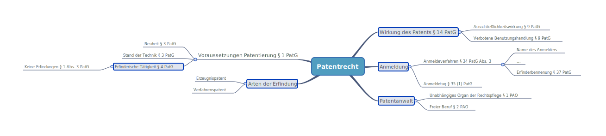
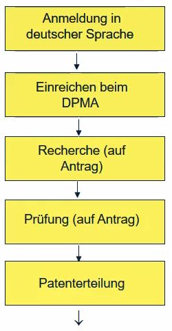
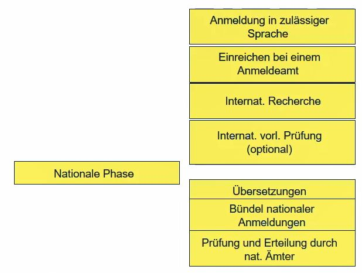
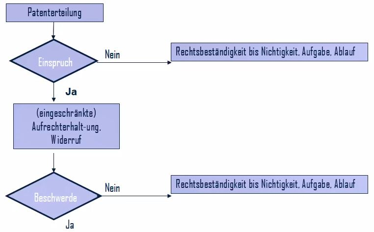

# Patentrecht

## 🗺️Paragraphenübersicht

## 🪧Was ist ein Patent?

* Technisches Schutzrecht, dass bestimmte Auflagen erfüllen muss
* Zeitlich befristetes Ausschließlichkeitsrecht 
  * Patentinhaber wird zugestanden anderen das Patent zu nutzen
  * Wirtschaftspolitisch ist Patent **kein Monopol**

## **⁉️Sinn und Zweck eines Patents**

**Vier klassische Theorien:**

1. **Eigentumstheorien:** Herrschaftsrecht über geistige Leistung
2. **Offenbarungstheorie:** Interessen der Allgemeinheit. Gesellschaft soll davon profitieren, dass jemand eine Entwicklung gemacht hat.
3. **Belohnungstheorie:** Belohnung des Erfinders, weil er für Gesellschaft Erfindung gemacht hat.
4. **Ansporntheorie:** Ansporn aus Belohnung und Verwertungsmöglichkeiten

## 🧭Ausschließlichkeitswirkung

* Geregelt in [§ 9 PatG](https://www.gesetze-im-internet.de/patg/__9.html)
* Allein der Patentinhaber ist befugt, das Patent im Rahmen des geltenden Rechts zu benutzen.
* Jedem Dritten ist es verboten:
  * ein **Erzeugnis** herzustellen etc. das Gegenstand des Patents ist
  * ein **Verfahren** anzuwenden, das Gegenstand das Patent ist. Patentverletzung erfolgt bei Anwendung des Verfahrens z. B. Patentgeschützte Routine in Software ist bei Besitz der Software keine Verletzung. Bei Ausführung der Software schon. \[...\] oder Anbietung im Geltungsbereich des Gesetzes.
  * Ein Erzeugnis anzubieten oder in Verkehr zubringen ..., dass mit dem patentierten Verfahren erstellt wurde. Kombination aus oben. Auf Erzeugnis gibt es keinen Patenschutz. Auf Verfahren schon.
* Es muss nicht unbedingt Geld verdient werden.

## 🗃️Überblick Patentsystem

* Organisation nach **Territorialitätsprinzip** d. h. jeder Staat definiert eigene Regeln z. B. Prüfungen, Anfechtbarkeit etc.
* In Deutschland geregelt im [PatG](https://www.gesetze-im-internet.de/patg/). Europäisches Patentübereinkommen EPÜ kann auch Patente mit Wirkung für Deutschland abtreten. Deutschland hat also Rechte abgetreten. PatG wurde dafür harmonisiert.
* Patentzusammenarbeitsvertrag \(PCT\) ist ein Vertrag dem eine große Zahl von Ländern beigetreten sind. 
  * Es werden keine Patente erteilt. Patente werden durch einzelne Länder / Europäisches Patentamt erteilt 
  * Es ist ein übergeordnetes, vorgeschaltetes Anmelde- und Recherche verfahren.

## ⏳Patentierungsvoraussetzungen

* Geregelt in [§ 1 PatG](https://www.gesetze-im-internet.de/patg/__1.html), Art. 52 EPÜ
* Patente werden für Erfindungen auf allen Gebieten der Technik erteilt, sofern sie:
  * **neu** sind
  * auf einer **erfinderischen Tätigkeit** beruhen und 
  * **gewerblich anwendbar** sind
* **Neuheit**:
  * Geregelt in [§ 3 PatG](https://www.gesetze-im-internet.de/patg/__3.html), Art. 54 EPÜ
  * Eine Erfindung gilt als neu, wenn sie nicht **Stand der Technik** gehört.
  * Man sollte nicht das, was man erfunden hat, der  Öffentlichkeit zugänglich gemacht haben d. h. Möglichkeit Kenntnis zu nehmen, einräumen. 
  * Vgl. Diplomarbeit, die Erfindung enthält und in Bibliothekskatalog eingestellt wurde.
* **Stand der Technik:**
  * Geregelt in [§ 3 PatG](https://www.gesetze-im-internet.de/patg/__3.html), Art. 54 EPÜ
  * Der **Stand der Technik** umfasst alle Kenntnisse, die vor dem für den **Zeitrang der Anmeldung** maßgeblichen Tag durch schriftliche oder mündliche Beschreibung, durch Benutzung oder in sonstiger Weise der Öffentlichkeit **zugänglich gemacht** worden sind.
  * Zeitrang der Anmeldung ist Anmeldetag. Man kann in anderen Ländern ebenfalls zu diesem Tag anmelden.
* **Neuheit:**
  * Liegt nicht mehr vor, wenn die Erfindung bereits vor dem Anmeldetag der Öffentlichkeit zugänglich gemacht wurde. Dies umfasst:
    1. schriftlich \(sämtliche Vereinbarungen\)
    2. mündlich \(Seminar, Messe, Tagung\)
    3. in einem Produkt z. B. Ausstellung des Produkts
  * Entgegenwirken mit **Geheimhaltungsvereinbarung.** Man sollte Adressatenkreis steuern. Dann kann man argumentieren, dass es nicht der Öffentlichkeit bekannt gemacht wurde.
* **Erfinderische Tätigkeit:**
  * Geregelt in [§ 4 PatG](https://www.gesetze-im-internet.de/patg/__4.html), Art. 56 EPÜ
  * Eine Erfindung gilt als auf einer erfinderischen Tätigkeit beruhend, wenn sie sich für den Fachmann nicht in naheliegender Weise aus dem Stand der Technik ableiten lässt.
* **Keine** Erfindungen sind dem [§ 1 Abs. 3 PatG](https://www.gesetze-im-internet.de/patg/__1.html):
  * **Entdeckungen** \(...\)
  * **ästhetische Formschöpfungen**
  * Pläne, Regeln und Verfahren für **gedankliche Tätigkeiten**, \(...\) sowie **Programme für Datenverarbeitungsanlagen**
  * **Wiedergabe von Informationen**
  * **Obacht:** Nur Programme **als solches** sind nicht patentierbar, kommt noch was hinzu, ist es das ggf. patentierbar.
* **Erfinder:**
  * Erfinder, ist derjenige, der das technische Problem mit technischen Mitteln einer Lösung zugeführt, also die technische Regel entwickelt hat.
  * Bei Doppelerfindungen \(zeitgleiche Erfindung\) steht demjenigen das Recht auf das Patent der Erfindung als erstes beim Patentamt angemeldet hat.
  * Erfindung kann übertragen werden z. B. auf Arbeitgeber übergehen.
  * Auch **Erfindergemeinschaft** d. h. mehrere Erfinder möglich.

## 🧑‍🔬Arten der Erfindung

* **Erzeugnispatent:** \(körperliche\) Sache mit spezifischen technischen Eigenschaften
* **Verfahrenspatent:** technisches Handeln mit evtl. mehreren Verfahrensmaßnahmen
  * **Beispiel:** Funktionsweise von Regelungsmechanismen

## 🐌Anmeldeverfahren

* Geregelt in [§ 34 PatG](https://www.gesetze-im-internet.de/patg/__34.html) Abs. 3.
* Schriftliche Anmeldung mit:
  * Name des Anmelders
  * Antrag auf Patenterteilung \(enthält kurz die Erfindung erklärt\)
  * Patentanspruch bzw. Patentansprüche
  * Beschreibung
  * ggf. erforderliche Zeichnungen
  * Erfinderbenennung \(bis 15 Tage nach Anmeldung; geregelt in [§ 37 PatG](https://www.gesetze-im-internet.de/patg/__37.html)\)
  * Anmeldegebühr \(gem. Patentkosten-Gesetz\)

**Ablauf nationale Anmeldung in Deutschland:**

* Anmeldung kann auch in anderer Sprache eingereicht werden. Nach 3 Monaten \(bei anderen Sprachen\) und 12 Monaten \(bei Englisch und Französisch\) ist Übersetzung erforderlich.

**Ablauf europäische Anmeldung:**

* Anmeldung in deutsch, englisch oder französisch.
* Recherche ist nicht optional. 
* Man erhält nur Bündelpatent muss i. d. R. nationale Phase eingeleitet werden. D. h. es sind weitere Aktionen notwendig.

**Ablauf internationale Anmeldung:**

* Man muss schauen, welches Anmeldeamt ist zuständig und welche Sprache ist dann notwendig.
* Es erfolgt internationale Recherche, die beantragt und bezahlt werden muss.
* Internationale vorl. Prüfung ist optional.
* Mit Überführung in nationale Phase beginnt eigentliche Patenterteilung. Vornahme durch z. B. Europäisches Patentamt.
* PCT-Anmeldung ist also ein Bündel von nationalen Anmeldungen, das ab gewissem Zeitpunkt in nationale Verfahren zerfällt.

## 💊Wirkung des Patents

* Geregelt in [§ 14 PatG](https://www.gesetze-im-internet.de/patg/__14.html) Art. 69 EPÜ
* Der **Schutzbereich** des Patents und der Patentanmeldung wird durch den Inhalt der Patentansprüche bestimmt. Die Beschreibung und die Zeichnung sind jedoch zur **Auslegung** der Patentansprüche heranzuziehen. 
* Beschreibung / Zeichnung sollte sorgfältig ausgearbeitet werden.

## ⛔Verbotene Benutzungshandlungen

* Geregelt in [§ 9 PatG](https://www.gesetze-im-internet.de/patg/__9.html). 
* Für geschütztes oder durch geschütztes Verfahren hergestelltes Erzeugnis:
  * Herstellen
  * Anbieten
  * In Verkehr bringen
  * Gebrauchen
  * Zu den genannten Zwecken einführen oder Besitzen
* für geschütztes Verfahren:
  * Anwenden oder \(bösgläubig\) anbieten.

## 🙋Einspruchsverfahren

## 🌄Anmeldetag

* Geregelt in [§ 35 \(1\)](https://www.gesetze-im-internet.de/patg/__35.html), Art 80 EPU
* Mit Zuerkennung des Anmeldetags wird Priorität der Anwendung gesichert. \(Erstanmelderprinzip\)
* Vorliegen muss
  * **Identität des Anmelders** \(z. B. Name\) muss vorgestellt werden
  * **Antrag**
    * Wer Anmelder ist
  * **Beschreibung der Erfindung**
    * Muss Angaben enthalten, die **dem Anschein nach** als Beschreibung anzusehen sind.
    * Weil Formalprüfer kann nicht nachvollziehen, ob Beschreibung sinnvoll.
  * **Figuren**
    * Nur wenn in Beschreibung Bezug genommen wird.
    * Tag, an dem Figuren vollständig vorliegen, wird dann Anmeldetag
* Nicht erforderlich sind
  * ausformulierte Patentansprüche
  * Gebührenzahlung
  * Spracherfordernis \(z. B. beliebige Sprache\)

## 👣Einreichung der Anmeldung

* beim zuständigen Amt \(DPMA, EPA, nationale Ämter, OMPI\)
* direkt / per Post \(ungünstig, weil man Anmeldetag nicht kennt\), Fax, elektronisch
* Formatanforderungen an Datei z. B. PDF müssen berücksichtigt sein.
* Über Patentinformationszentrum

## 🎀Aufbau der Patentanmeldung

* Titel
* Einleitung
* Stand der Technik
* ggf. Aufgabenstellung
* Kurzbeschreibung der Erfindung
* Kurzbeschreibung der Figuren
* Ausführliche Beschreibung der Erfindung anhand der Figuren
* Ansprüche
  * Patentanspruch sollte formuliert werden, wenn genügend Zeit besteht.
* \(Zusammenfassung\)

## ✅Patentstrategie

* Stand der Technik, Schutzfähigkeit
* Benutzungsattraktivität für Wettbewerber
* Aufwendigkeit einer Umgehungslösung
  * Hoher Aufwand für Umgehungslösung
* Wahrnehmbarkeit, Nachweisbarkeit
* Patentportfolio
  * Man erzeugt sich Ruf als Innovationsführer z. B. BOSCH
* Stärkung der Vertragssituation
  * Wenn man aus starken Patentportfolio schöpfen kann, kann man im Streitfall ggf. selbst Wettbewerber verklagen.
* **Lizenzeinnahmen**: Je attraktiver eine patentierte Problemlösung für den Wettbewerber ist, desto wahrscheinlicher
* **Verbieten**: Behinderung von Wettbewerbern zur Verbesserung der eigenen Marktposition
* **Abschrecken**: Wettbewerber müssen beim Einsatz eigener Patente mit Gegenangriffen rechnen.
* **Lizenztausch**: Geigenseitige Gewährung von Lizenzen verschafft beiden Partnern Freiräume
* **Schutz gegen Nachahmung**: Die kostenlose Übernahme eigener Entwicklungsergebnisse durch Wettbewerber wird verhindert.
* **Zwingen zu "Design" Around**: Der Zang, Patente umgehen zu müssen, führt bei Wettbewerbern zu Nachteilen.
* **Reputation**: Patente werden als Ausweis innovativer Stärke gewertet.

## 👩‍⚖️Patentanwalt

* unabhängiges Organ der Rechtspflege \([§ 1 PAO](https://www.gesetze-im-internet.de/patanwo/__1.html)\) d. h. Anwendung des Rechts zwischen den Menschen / Institutionen
* übt einen freien Beruf aus \([§ 2 PAO](https://www.gesetze-im-internet.de/patanwo/__2.html)\) d. h. Tätigkeit ist unabhängig / selbstständig.
* Voraussetzung:
  * Technische Befähigung
  * Erforderliche Rechtskenntnisse

## 👶Ausbildung zum Patentanwalt

* Abgeschlossenes technisch-naturwissenschaftliches Studium
* Mind 1 Jahr technische Tätigkeit
* Mind. 34 Monate Ausbildung auf dem Gebiet des gewerbl. Rechtsschutzes
  * 26 Monate in Kanzlei
  * Begleitet von Fernstudium allg. Recht
  * 8 Monate "Amtsjahr"

## 🍦Aufgaben des Patentanwalts

* Patente / Gebrauchsmuster 
  * Darf alleine vertreten vor dem Bundesgerichtshof
* Marken
* Geschmacksmuster
* Sortenschutz
* Halbleiterschutz
* Arbeitnehmererfindungsrecht
* Softwareschutz

## 🧑‍💻Computerprogramm

* Software an sich ist nicht patentfähig
* Softwareerfindungen sind patentierbar, falls gem. § 1 Abs. 1 PatG:
  * Patenten werden für Erfindungen auf allen Gebieten der Technik erteilt, sofern sie neu sind, auf einer erfinderischen Tätigkeit beruhen und gewerblich anwendbar sind
  * Auf allen Gebieten der Technik bedeutet, dass nur technische Erfindungen patentierbar sind

## 🛩️Urheberrecht

* notwendig ist Individualität, aber nicht geschützt ist routinemäßiges/ allgemeines Verwandtes
* Nicht geschützt sind Ideen und Grundsätze Schnittstelleninformationen, Pflichtenheft, Handbücher

## 🏫Patentschutz

* Patentschutz nur dann, wenn die Lösung des konkreten technischen Problems neu ist und auf erfinderischer Tätigkeit beruht.
* Außerhalb der Technik liegende Anweisungen genügen in diesem Zusammenhang nicht; sin sind nur in dem Umfang von Bedeutung, in dem sie auf Lösung de technischen Problems mit technischen Mitteln Einfluss nehmen. D. h. Algorithmus muss konkrete technische Lösung entfalten.

## 🥊Patentschutz vs. Urheberschutz bei Software

| Thema | Patentrecht | Urheberrecht |
| :--- | :--- | :--- |
| Entstehung | Anmeldung/Prüfung/Erteilung | Programmierung |
| Schutzgrenze | kein Schutz für „Software als solche“ | kein Schutz für Ideen u. Grundsätze/ Algorithmen |
| Schutzumfang | Schutz v.Ideen u. Lösungsprinzipien | Schutz gegen Vervielfältigung, Internetverbreitung, Internetverbreitung, Umarbeitung d. Programms in Programms in konkreterForm |
| Dauer | 20 Jahre nach Anmeldung | 70 Jahre nach Tod. d. Urhebers |

