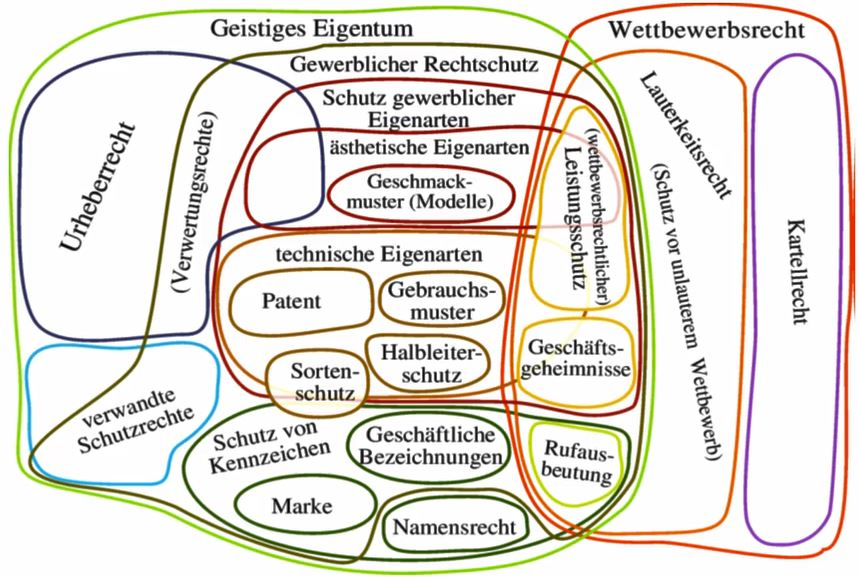

# Übersicht

* **Gewerblicher Rechtschutz** sind Immaterialgüterrechte, die einen streng gewerblichen Bezug haben.
* Registerschutzrechte sind:
  * Patentrecht \(mit Prüfung bei Anmeldung\)
  * Markenrecht
  * Designrecht \(Schutz für Formschöpfungen\)
  * Gebrauchsmusterrecht \(wird nicht geprüft; wird eingetragen wie angemeldet\)
* Patentrecht ist Ausschließlichkeitsrecht d. h. Allein der Inhaber hat das Recht das Patent zu verwerten und kann es allen anderen untersagen
* Schutz des geistigen Eigentums umfasst Urheberrecht + gewerblicher Rechtsschutz
* Wettbewerbsrecht \(unlauterer Wettbewerb...\)
* Sortenschutz = Schutz von Pflanzenzüchtungen
* Halbleiterschutz = Schutz von 3d-Strukturen
* Namensrecht = reines Persönlichkeitsrecht
* Wettbewerbsrechtlicher Leistungsschutz

