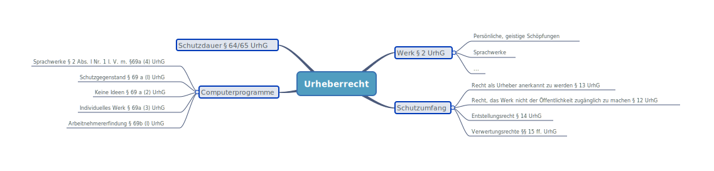

# Urheberrecht

### 🗺️Paragraphenübersicht

### Geschützte Werke

* Geregelt in [§ 2 UrhG](https://www.gesetze-im-internet.de/urhg/__2.html).
* Geschützte Werke sind nur persönlich geistige Schöpfungen
* Darunter fallen: Sprachwerke, Werke der Musik, Werke der bildenden Künste einschließlich Baukunst oder Darstellungen wissenschaftlicher oder technischer Art.

### Persönliche Geistige Schöpfung

Kriterien für persönlich, geistige Schöpfung:

1. **Persönliches Schaffen:** Setzt Handlungsergebnis voraus, das durch den Menschen geschaffen wurde \(Realakt\).
2. **Wahrnehmbare Formgestaltung:** keine Ideen
3. **Geistiger Gehalt:** Urheber muss Gedanken oder Gefühlswelt erzeugen
4. **Eigene, persönliche Prägung:** Originalität und Individualität. Je nach Werk kann **Schöpfungshöhe** unterschiedlich sein.

### Unterschied Design-Schutz und Urheberrecht

* Design-Schutz wird für max. 25 Jahre \(5x5 Jahre\) ab Eintragung gewährt gem. [§ 27DesignG](https://www.gesetze-im-internet.de/geschmmg_2004/__27.html)
* Urheberschutz entsteht mit Schaffung des Werkes \(**Schöpfungsakt**\)
* Urheberrecht gilt bis 70 Jahre nach dem Tod gem. [§ 64 / 65 UrhG](https://www.gesetze-im-internet.de/urhg/__64.html). Bei mehreren 70 Jahre nach Längstlebendem Urheber.

### Schutzumfang

* Recht, als Urheber \(= Schöpfer des Werkes, § 7 UhrG\) anerkannt zu werden \([§ 13 UrhG](https://www.gesetze-im-internet.de/urhg/__13.html)\)
* Recht, das Werk **nicht** der **Öffentlichkeit** zugänglich zu machen \([§ 12 UrhG](https://www.gesetze-im-internet.de/urhg/__12.html)\)
* **Entstellungsverbietungsrecht** \([§ 14 UrhG](https://www.gesetze-im-internet.de/urhg/__14.html)\)
* **Verwertungsrechte** \([§§ 15 ff UhrG](https://www.gesetze-im-internet.de/urhg/__15.html)\)

### Computerprogramme

* Sind Sprachwerke gem. [§ 2 Abs. I Nr. 1](https://www.gesetze-im-internet.de/urhg/__2.html) i. V. m. [§ 69a \(4\) UrhG](https://www.gesetze-im-internet.de/urhg/__69.html)
* **Schutzgegenstand** = Programm in jeder Gestalt einschl. Entwurfsmaterial z. B. Flussdiagramm \([§ 69 a \(I\) UrhG](https://www.gesetze-im-internet.de/urhg/__69.html)\)
* Ideen und Grundsätze, die einem Element eines Computerprogramms zugrunde liegen, einschließlich der den Schnittstellen zugrundeliegenden Ideen und Grundsätze, sind **nicht** geschützt \([§ 69 a \(2\) UrhG](https://www.gesetze-im-internet.de/urhg/__69.html)\)
* Nur wenn individuelles Werk, allerdings sind zur Bestimmung ihrer Schutzfähigkeit keine anderen Kriterien, insbesondere nicht qualitative oder ästhetische, anzuwenden \( [§ 69a \(3\) UrhG](https://www.gesetze-im-internet.de/urhg/__69.html)\)
* Bei angestelltem Programmierer ist ausschließlich der Arbeitgeber zur Ausübung aller vermögensrechtlichen Befugnisse an dem Computerprogramm berechtigt, sofern nichts anderes vereinbart ist \([§ 69b \(I\) UrhG](https://www.gesetze-im-internet.de/urhg/__69.html)\)

