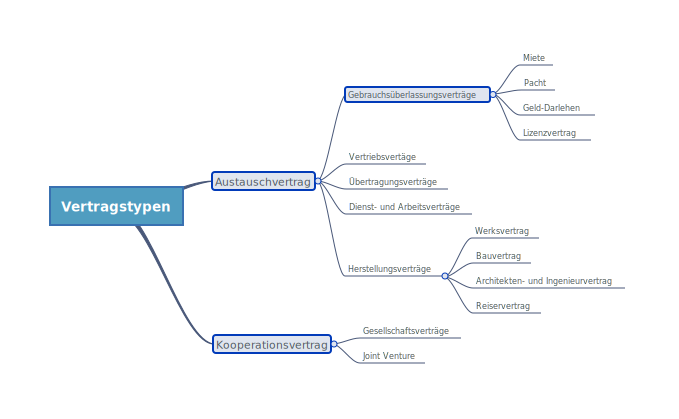

# Einführung / Überblick

## Vertrag

* Verträge = _Ein Vertrag ist die Verwirklichung von Ideen_ → D. h. man setzt mit Verträgen eigene Ideen z. B. Regelung der Zusammenarbeit um Produkt am Markt zu platzieren.
* Verträge, dienen dazu alles so zu regeln, dass das Wirtschaftsleben, so wir es kennen, funktioniert.

## Vertragstypen

* Man unterscheidet die beiden Vertragstypen:
  * **Austauschverträge** → Bezieht sich auf **Gegenläufigkeit** \(z. B. Auftragnehmer vs. Auftraggeber oder Verkäufer und Käufer etc.\)
  * **Kooperationsverträge** → Bezieht sich auf **Gemeinsamkeit** \(z. B. Startup mit mehreren  Kompagnon, die dasselbe Ziel haben z. B. BMW und Startup kooperieren für neues Produkt\)
  * Man unterscheidet dann **Austauschverträge** weiter nach **Übertragungsverträge** etc.
* **Übertragungsvertrag:** Ziel dieser Verträge ist die Verschaffung des Eigentums an einer Sache \(z. B. Auto, Grundstück\) oder einem Recht \(z. B. Forderung, Gesellschaftsanteil\)
* Varianten vom **Übertragungsvertrag**
  * **Kauf beweglicher Sachen** §§ 433 ff. BGB z. B. Brötchenkauf / Maschinenkauf
  * **Grundstückskaufvertrag** §§ 433 ff., 311b BGB → Sonderregelungen z. B. bei Form weil besondere Bedeutung für Vertragsparteien
  * **Tausch** § 480 BGB
  * **Factoring** §§ 433 ff., 453 BGB
  * **Unternehmenskauf** § 433 ff. BGB
* Unterschied zwischen Tausch und Kauf beweglicher Sache: Bei Tausch wird Sache gegen Sache getauscht. Bei Kauf Sache gegen Geld.
* **Factoring** beinhaltet Kauf von Forderungen z. B. Forderungsverkauf von Konsumentendarlehen bei Saturn an einen Dritten.
* **Herstellungsvertrag:** Ziel dieser Verträge ist die Herstellung eines bestimmten Werkes
* Varianten vom **Herstellungsvertrag**
  * **Werksvertrag** §§ 631 ff. BGB
  * **Bauvertrag** §§ 650a ff. BGB
  * **Architekten- und Ingenieurvertrag** §§ 650p BGB
  * **Reisevertrag** §§ 651a BGB
* **Dienst- und Arbeitsverträge:** Ziel ist die Herstellung einer Dienstleistung
* **Vertriebsverträge:** Ziel ist der Verkauf
* **Gebrauchsüberlassungsverträge:** Ziel dieser Verträge ist die Überlassung einer bestimmten Sache, bestimmter Verwertungsrechte für eine bestimmte Sache für eine gewisse Dauer.
* Beispiele für **Gebrauchsüberlassungsverträge**:
  * **Miete** §§ 535 ff. BGB→ Gewerberaum-Mietrecht / Privat-Mietrecht
  * **Pacht** §§ 581 ff. BGB
  * **Gelddarlehen** §§ 488 ff. BGB
  * **Lizenzvertrag** z. B. Lizenzierung von Bildern für eine bestimmte Zeitdauer.

## Vertragsverhandlung

* Vertragsgestaltung ist eingebettet in die **Vertragsverhandlung**
* **Vertragsverhandlung** umfasst
  * psychologische Aspekte → Sind sich Parteien nicht grün, hat man Problem sinnvollen Vertrag  zu gestalten
  * rechtliche Aspekte
  * technische Aspekte  → z. B. Pläne / Leistungsverzeichnis bei Bauverträgen
  * wirtschaftliche Aspekte → z. B. Was ist Mietzins? Wie bekomme ich regelt, dass Kundenstamm bei mir bleibt?
* **Flexibilität** z. B. bei Klausel, worauf sich Parteien nicht verständigen können. Wie lässt sich Klausel umformulieren, dass Lösung gefunden wird?
  * **Nähe vs. Distanz** z. B. man möchte Vertrag mit bestimmten Kunden schließen vs. man suggeriert Distanz, dass noch andere Vertragspartner im Rennen sind
  * **Zeitdruck vs. Verlangsamen** z. B. zeitlichen Druck aufbauen bei Vertragspartnern
  * **Entscheidungsdruck vs. Verzögerungen** z. B. Druck bei Vertragsabschluss vs. Verlangsamung etwa Rücksprache mit Aufsichtsrat
  * **Alternativen beschränken vs. Alternativen aufzeigen** z. B. auf Detail beharren oder Alternativen aufzeigen
* Kommunikation passiert auf
  * **Sach- und Inhaltsebene**
  * **Beziehungsebene** z. B. Nachbarschaftsstreit muss beigelegt sein, erst dann kann Vertrag zwischen streitenden Parteien geschlossen werden.
* Nachricht hat
  * Sachinhalt \(worüber informiere ich\)
  * Selbstoffenbarung \(was ich von mir kundgebe\)
  * Beziehung \(was ich von dir halte und wie wir zueinander stehen\)
  * Appell \(wozu ich dich veranlassen will\)
* Fallen in der Vertragsgestaltung:
  * Reziprozitätsfalle → "Tür ins Gesicht Technik" → Man verkleinert seine ursprüngliche Forderung, Gegenpartei sieht sich dann gezwungen Vertrag abzuschließen
  * Konsistenzfalle → "Fuß in die Tür Technik" → "Salami-Taktik" hat man ein Zugeständnis erreicht, wird man auch zweites erreichen
  * Knappheit

