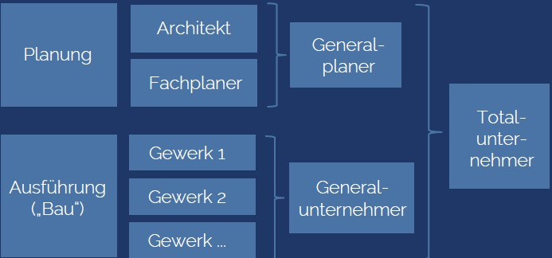

# Herstellungsvertrag

## Arten von Herstellverträgen

* Allgemeiner Werkvertrag → Man schuldet Erfolg
* Bauvertrag \(Sonderform: Verbraucherbauvertrag\)
* Architekten- und Ingenieurvertrag
* Bauträgervertrag
* Reisevertrag → Reiseleistungen / Reise zu erbringen → Geregelt in Werksvertrag → Anbieter schuldet nicht nur bestmögliche Tätigkeit → Reisender soll auch Reise an sich haben

## Gesetzlicher Rahmen

* § 631 Hauptpflichten
* § 632, 632a - Regelungen zur Vergütung
  * 632a: Unternehmer kann nach Leistungsfortschritt Abschlagszahlungen verlangen → Schutzmechanismus für Unternehmer → Unternehmer soll nicht Geld hinterherlaufen müssen
  * § 633 -639 - Gewährleistungsrecht
  * § 640 - Abnahme
    * Abnahme ist wichtig für Unternehmer → Vergütung wird mit Abnahme fällig → Ohne Abnahme ist kein Stellen der Schlussrechnung möglich. → Zentrales Streitthema im Werksvertrag
  * § 644  - Gefahrtragung  Der Unternehmer trägt die Gefahr bis zur Abnahme liegt beim Unternehmer
  * § 650 - Werklieferungsvertrag → Gilt nur für bewegliche Sachen → Je nachdem ist man im Kaufvertragsrecht oder \(...\)

## Verträge am Bau

### Begrifflichkeiten

### Einzelvergabe vs. Generalunternehmervergabe

* Einzelvergabe
  * Man muss bei Schnittstellen zwischen Bauunternehmern betrachten
* GU-Vergabe
  * Man hat nur einen Vertrag mit Generalunternehmer
  * Man wendet sich bei Mängeln nur an Generalunternehmer
  * Man hat nichts mit Nachunternehmer zu tun als Bauherr
  * Geht Generalunternehmer pleite, muss man Regelungen mit Nachunternehmer treffen um Bauvorhaben voranzutreiben

### Wesentliche Regelungsinhalte

* Leistungsbeschreibung
* Vergütung
* Änderungen der Leistung
* Ausführungsfristen z. B. GANTT Diagramm, wann muss Rohbau fertig sein etc.
* Abnahme
* Gewährleistungen
* \(...\)

### VOB/B \(Vergabe- und Vertragsordnung für Bauleistungen\)

* VOB/A Allgemeine Bestimmungen
* VOB/B Allgemeine Vertragsbedingungen
* VOB/C Allgemeine Technische Vertragsbedingungen für Bauleistungen

### Leistungsbeschreibung

* **detailliert** → enthält detailliert Angaben zur Ausführung der Leistung → Im öffentlichen Bereich / bei kleinen Projekten → Problematisch sind vergessene Details
* **funktional** \("Schlüsselfertig\) → enthält lediglich Angaben zu Zweck und Funktion enthalten sind, aber keine Details beschrieben werden → Man beschreibt keine Details → "z. B. Schlüsselfertiges Hochhaus mit 10 Etagen"

### Beispiel eines Leistungsverzeichnisses

* Abgerechnet wird tatsächlicher Aufwand z. B. bei Arbeitsstunden
* Nur Einheitspreis ist fest vereinbart. Nicht aber die Menge!
* Mengenrisiko sollte auf Bauunternehmer abgewelzt werden z. B. KG Rohre verlegen 1.000 EUR unabhängig der Menge.

### Vergütung

* **Einheitspreisvertrag** → Ein Einheitspreisvertrag ist ein Vertrag, bei dem sich die Vergütung der Bauleistung nach den tatsächlich ausgeführten Leistungsmengen und den vereinbarten Einheitspreisen richtet.
* **Detail-Pauschalvertrag** → Nur Leistungen, die in Leistungsverzeichnis genannt sind, sind pauschalisiert → Enthält Leistungsverzeichnis Leistung nicht oder ist nicht ausreichend detailliert → Kann Bauunternehmer Forderung stellen → Leistung bleibt gleich → Pauschalisierung heißt hier nicht, dass alles drin ist!
* **Global-Pauschalvertrag \("Komplettheitsvertrag"\)** → Alles ist drin. → Häufig mit 10 % - 20 % Gewinnzuschlag

### Leistungsänderungen

* §§ 650b, 650c BGB
  * Eigentlich gilt "Verträge sind einzuhalten". Hiervon weichen §§ 650b, 650c ab.
  * Einseitiges Recht für Besteller.
* § 2 Abs. 5, 6 VOB/B - geänderte oder zusätzliche Leistungen
* Die Höhe des Vergütungsanspruchs für den infolge einer Anordnung des Bestellers nach § 650b Abs. 2 vermehrten oder minderten Aufwand ist nach den tatsächlich erforderlichen Kosten mit angemessenen Zuschlägen für allg. Geschäftskosten, Wagnis und Gewinn zu ermitteln.

