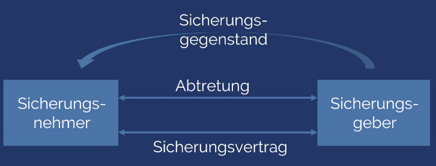

# Sicherungsmittel

## Übersicht der Sicherungsmittel

* Personalsicherheiten
  * Ein Dritter übernimmt für die Verfplichtungen des Schuldners Haftung
  * Man hat 3 Personen Verhältnis \(Gläubiger, Schuldner und Dritte Person, die für Verpflichtungen des Schuldners haftet\)
* Sachsicherheiten
  * Sache / Gegenstand haftet für die Erfüllung der Verpflichtungen des Schuldners
  * z. B. Grundschuld / Sicherungsabtretung / Sicherungsübereigneter PKW

## Personalsicherheiten

* Bürgschaft \(§765 BGB\) → Rangverhältnis; Bürge wird erst herangezogen wenn Schuldner nicht zahlt
* Schuldbeitritt \(nicht geregelt im Gesetz\) → Man tritt in die gleiche Position wie eigentlicher Schuldner → vorteilhaft für Gläubiger
* Patronatserklärung \(nicht geregelt im Gesetz\) → Bei Konzernen interessant → Muttergesellschaft haftet für finanzschwache Töchter → z. B. bei umfangreichem Mietvertrag
* Garantie \(nicht wirklich geregelt im Gesetz\) → Man hat z. B. gegen Hersteller keine Ansprüche → Hersteller machen Garantieerklärung zwischen Verbraucher und Hersteller

## Gewährleistung vs. Garantie

* Gewährleistung ist immer bezogen auf denjenigen mit dem man Rechtsverhältnis eingeht → Verbraucher + Händler
* Garantie mit Dritten → z. B. Verbraucher + Hersteller PKW
* Man kann sowohl Garantie und Gewährleistung durchsetzen

## Sachsicherheiten

* Eigentumsvorbehalt \(§ 449 BGB\)
* Pfandrecht \(§1204 BGB\) → Taugt  z. B. nicht für PKW weil Übergabe der Sache an Gläubiger nicht sinnvoll ist → Schwierig in Geschäftsalltag zu integrieren → Man bleibt Eigentümer / Gläubiger wird Besitzer → Alternative ist Sicherungsübereignung
* Hypothek \(§1113 BGB\) / Grundschuld \(§1191\)
* Sicherungsübereignung /- abtretung → nicht geregelt im Gesetz → entstanden in der Wirtchaftspraxis → Man bleibt Besitzer / Eigentum geht an Gläubiger → Anstelle der Eigentumsübergabe wird Übergabesurrogat \(§ 930\) vereinbart

## Akzessorietät der Sicherungsmittel

* Abhängigkeit zwischen gesicherter Forderung und Sicherungsrecht → Anspruch weg, dann Sicherungsmittel weg → Forderung weg, dann kann Sicherungsmittel weg
* Akzessorische Sicherungsmittel
  * Bürgschaft
  * Hypothek
  * Pfandrecht
* Nicht-akzessorische Sicherungsmittel → Forderung kann untergehen, Sicherungsmittel aber weiterhin bestehen bleiben → akzessorität wird nachgebildet
  * Grundschuld → Grundschuld ist unabhängig der Forderung
  * Sicherungsübereignung / -abtretung

## Sicherungsvertrag

* Schuldrechtlicher Akzessoritätsersatz
* z. B. bei Darlehensvertrag wird Zweckerklärung gemacht
*  
* Sicherungsvertrag stellt Verbindung zwischen Schuldrechtlicher Vertrag \(Darlehen\) und Abtretung her
* Sicherungsvertrag vereinbart Rückgabeanspruch der Schuldners ggü. der Bank, wenn Forderung erloschen ist.
* Schuldrechtlicher Vertrag \(z. B. Darlehensvertrag und Abtretung\)

## Warum werden Sicherungsmittel vereinbart?

* Schutz der Vertragserfüllung im Falle der Insolvenz → Was ist wenn der Vertragspartner nicht mehr kann / will?
* Z. B. Verkäufer einer Maschine → Käufer geht vor Schlussrate in Insolvenz
* Bei Insolvenz: \(wichtig für Klausur, allerdings nur oberflächlich wie unterhalb\)
  * Aussonderung \(§ 47 InsO\) → § 449 BGB \(Durch Rücktritt kann Eigentum zurückerhalten werden\) → Eigentumsvorbehalt reduziert Risiko erheblich, da man mehr Geld erhält als nur die Insolvenzquote
  * Absonderung \(§ 47 ff. InsO\)  → Alternative

## Eigentumsvorbehalt

### Arten

* Einfacher Eigentumsvorbehalt \(§ 449 BGB\) → Eigentum verbleibt bei Verkäufer solange Kaufpreis nicht vollständig bezahlt wurde
* Erweiterter Eigentumsvorbehalt
  * Erstreckung auf weitere Forderungen

    * Erstreckung auf weitere Forderungen
      * Kontokorrentvorbehalt → Solange eine Forderung aus Geschäftsbeziehung offen bleibt, verbleibt Eigentum beim Gläubiger
      * Konzernvorbehalt → Eigentum an verkaufter Ware geht nicht erst über, wenn der Schuldner Forderungen auch an die andere Tochtergesellschaft erfüllt hat
    * Erstreckung auf Surrogat
      * Vorausabtretungsklausel → Großhändler verkauft weiter an Einzelhändler und übergibt Ware → Gutgläubiger Erwerb → Gläubiger hat als Sicherungsmittel Forderungen gegenüber Einzelhändler → Zwar ist Ware weg, Gläubiger hat dann aber die Forderung
      * Verarbeitungsklausel → Möbelhersteller kauft Bretter → Gläubiger erwirbt Teileigentum am Tisch bzw. Forderung aus Verkauf des Tisch

    **Personenverhältnisse**

  * Zwischen Gläubiger und Schuldner besteht Schuldrechtlicher Vertrag \(d. h. Geldforderung\)
  * Deckungsverhältnis z. B. Auftragsverhältnis → Hieraus ergibt sich Aufwendungsersatzanspruch / Regressverhältnis
  * Zwischen Gläubiger und Bürge besteht Bürgschaftsvertrag
  *  

## Arten der Bürgschaft

* Bürgschaft auf Zeit \(§ 777 BGB\)
* Höchstbetragsbürgschaft → Bürgschaft ist auf bestimmten Betrag gedeckt
* Selbstschuldnerische Bürgschaft \(§ ?\) → Verzicht auf Einrede der Vorausklage → Bürge kann fordern, bevor er herangezogen wird, dass Schuldner zwangsvollstreckt wird → Eher unpraktisch für Gläubiger → Entwertet die Bürgschaft sehr
* Bürgschaft auf erstes anfordern \(§ ?\) → Muss erstmal an Gläubiger zahlen → Ggf. kann er in Rahmen von Prozess das Geld zurückfordern → hohes Risiko für Bürgen → Rechtlich oft nicht möglich z. B. bei Werksverträgen
* Ausfallbürgschaft → Bürge wird nur dann in Anspruch genommen, wenn Gläubiger schon alles ggü. dem Schuldner versucht hat.

## Misc

* Problem der Übersicherung → eigentlich frei, aber es darf keine Übersicherung des Gläubigers eintreten

